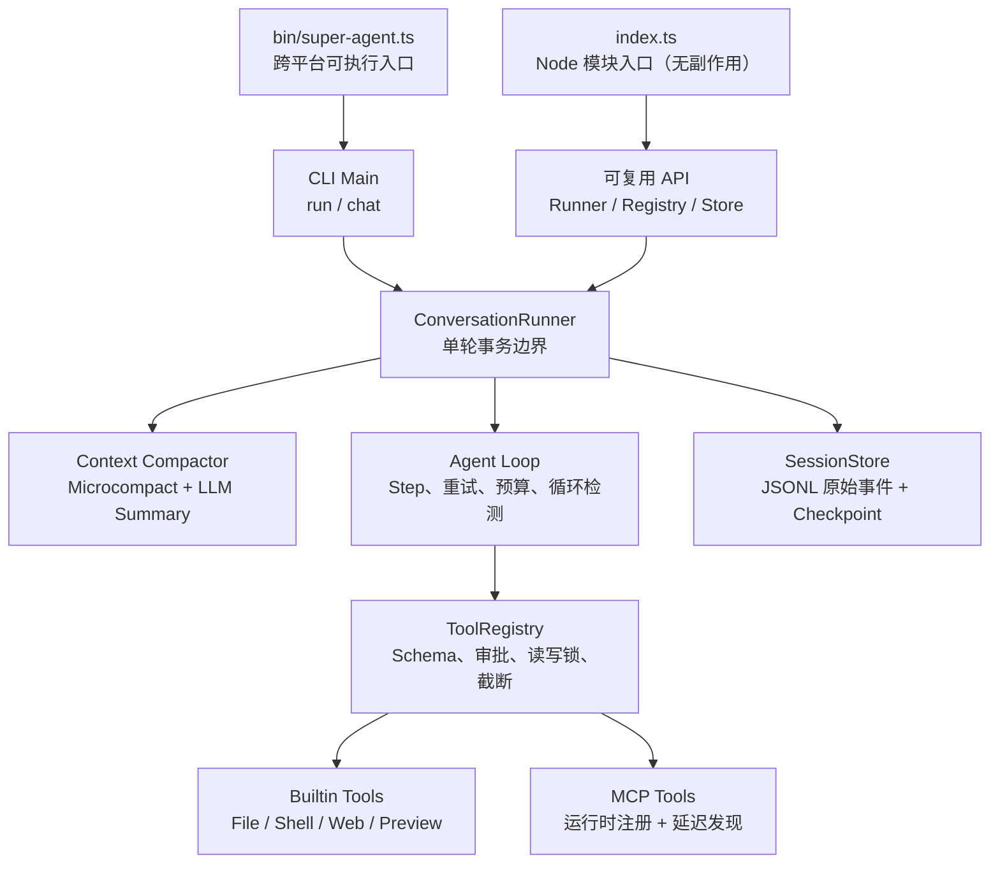

# Super-Agent

一个用于学习 Agent 工作原理的 TypeScript Demo。它保留多步 Agent Loop、工具审批与并发、
循环检测、上下文压缩、JSONL 会话和 MCP 延迟加载，但不追求生产系统的完备性证明。

## 项目范围

这个项目的目标是让一个人能够读懂并修改完整 Agent 链路。新增代码应直接帮助理解模型、
上下文、工具或会话；如果主要用于覆盖极端部署故障，应留在真实业务项目中，而不是加入这里。

明确不做：分布式或多写者一致性、exactly-once 工具账本、复杂 Session migration/rotation/quota、
OS 级 Sandbox、cgroup/seccomp/systemd、主机掉电证明、自动 archive/retention，以及为这些能力
服务的大型 fault matrix。Git 历史保留了曾经的生产化实验，需要时可以单独查阅。

## 快速开始

```bash
pnpm install
pnpm build
pnpm link --global
super-agent --help
```

首次运行前从 `.env-example` 创建 `.env`：macOS/Linux 使用 `cp .env-example .env`，PowerShell 使用 `Copy-Item .env-example .env`。

包提供两套互不混淆的入口：

- `super-agent`：真正的可执行 CLI。`package.json#bin` 由 npm/pnpm 在 macOS、Linux 生成 POSIX shim，在 Windows 生成 `.cmd`/PowerShell shim。
- `import { ... } from 'super-agent'`：无启动副作用的 Node 模块入口，类型声明位于 `dist/index.d.ts`。

CLI 包含两个子命令：

```bash
super-agent chat
super-agent chat --continue --session <session-id>
super-agent run "只回复 OK"
super-agent run --prompt "只回复 OK"
super-agent run "执行可信的写操作" --yes
```

不希望全局 link 时，可以使用开发入口 `pnpm cli -- chat`，或在构建后直接运行 `node dist/bin/super-agent.js run "任务"`。

`run` 提供稳定的退出码，适合脚本、CI 和其他进程调用；`chat` 使用 Node `readline` 进入交互模式。两者共用同一个对话编排器。会话状态已经由 JSONL 持久化，因此跨平台核心运行不依赖 tmux。仅在 macOS/Linux 需要人工挂后台或随时接回终端时，可以把 tmux 作为外层托管：

```bash
tmux new-session -s super-agent 'super-agent chat --continue --session <session-id>'
```

`run` 不会等待交互审批。读写工具默认拒绝；只有在可信环境显式传入 `--yes` 才会自动批准。

## 开发与调试

日常开发直接通过 `tsx` 执行源码，不需要先 build：

```bash
pnpm dev -- chat
pnpm dev -- run "只回复 DEV_OK"
```

需要断点调试时启动 Node Inspector，然后在 IDE 或 `chrome://inspect` 中连接 9229 端口：

```bash
pnpm debug -- chat
pnpm debug -- run "调试任务"
```

全局 link 的 `super-agent` 指向 `dist/bin/super-agent.js`。源码变化后可以手动执行一次 `pnpm build`，或者在一个终端持续编译、另一个终端按需重新执行 CLI：

```bash
# 终端 1：仅编译，不自动重跑 Agent
pnpm build:watch

# 终端 2
super-agent run "测试最新构建"
```

这里刻意不对 Agent 进程做保存即重启：`run` 可能产生模型费用或外部写操作，自动重放并不安全。通过 npm/pnpm 安装的非 link 版本也不会跟随本地源码变化，需要重新 build、打包并安装新版本。

质量检查：

```bash
pnpm typecheck
pnpm test
pnpm build
```

## 运行链路



一轮对话按以下顺序执行：

1. 用户消息先写入 append-only JSONL，再进入内存上下文。
2. 发送模型前执行压缩；若上下文或预算发生变化，立即写 checkpoint。
3. `AgentLoop` 每个 step 都重建 system prompt 和活跃工具集合。
4. 只读工具可并行执行；读写工具和循环可疑调用生成正式审批请求。
5. 每个成功 step 的原始消息与累计 token 预算写进同一条 JSONL 事件后落盘。
6. 下一 step 前再次压缩，避免长工具链持续膨胀上下文。
7. Agent Loop 结束后执行最后一次压缩，并无条件写恢复 checkpoint。

因此，会话文件同时保留两种视图：原始 `messages` 事件用于审计，最新 checkpoint 用于恢复压缩后的工作上下文。旧版分离的 `message`/`budget` JSONL 仍可继续读取。

## 上下文压缩

压缩分两层：

- Microcompact：清除较旧且可重建的读取/搜索类工具结果，保留写入和编辑结果。
- LLM Summary：超过阈值后，把旧的完整用户轮次滚动合并为结构化摘要，保留最近消息。

压缩会在 `before-turn`、`between-steps`、`after-turn` 三个时机运行。摘要调用也计入预算；预算耗尽后仍允许免费的 Microcompact，但不再发起摘要模型请求。摘要只有在合法、未超长且确实缩小上下文时才会替换原消息。

## 目录职责

| 目录/文件 | 职责 |
| --- | --- |
| `src/index.ts` | 无副作用的 Node 模块入口，集中导出稳定 API |
| `src/bin/super-agent.ts` | CLI 可执行入口、dotenv 加载和进程退出码 |
| `src/cli/main.ts` | Composition Root，装配配置、模型、工具和会话 |
| `src/agent/conversation-runner.ts` | 对话轮次编排、压缩时机、持久化边界 |
| `src/agent/agent-loop.ts` | 多 step 推理、重试、审批、预算和事件通知 |
| `src/agent/loop-detection.ts` | 每次 Agent Loop 独立的重复、乒乓和无进展检测 |
| `src/context/` | Prompt 组装与上下文压缩 |
| `src/core/tool-registry.ts` | 工具注册、延迟发现、审批策略、并发锁和生命周期 |
| `src/core/workspace.ts` | 文件工具的工作区路径与 symlink 边界 |
| `src/session/store.ts` | 流式加载 append-only JSONL 和 checkpoint 恢复 |
| `src/tools/` | 内置工具和真实 MCP 工具的延迟发现 `tool_search` |
| `src/mcp/` | GitHub 托管 Streamable HTTP MCP 客户端 |
| `src/cli/` | 子命令解析、run/chat 执行、终端展示和人工审批 |

## 配置

所有运行参数都集中由 `src/core/config.ts` 校验。主要环境变量如下：

| 变量 | 默认值 | 说明 |
| --- | --- | --- |
| `OPENAI_API_KEY` | 无 | OpenAI-compatible Provider 密钥 |
| `MODEL_BASE_URL` | `https://api.deepseek.com` | Provider Base URL |
| `MODEL_ID` | `deepseek-v4-flash` | 模型 ID |
| `TOKEN_BUDGET` | `1000000` | 会话累计 token 上限 |
| `AGENT_MAX_STEPS` | `15` | 单轮最大 step 数 |
| `AGENT_MAX_RETRIES` | `10` | 每个模型请求的重试次数，可为 0 |
| `CONTEXT_TOKEN_THRESHOLD` | `12000` | 触发摘要的估算 token 阈值 |
| `CONTEXT_KEEP_RECENT_MESSAGES` | `8` | 摘要后保留的最近消息数目标 |
| `CONTEXT_KEEP_RECENT_TOOL_MESSAGES` | `4` | 不做 Microcompact 的最近工具消息数 |
| `CONTEXT_MAX_SUMMARY_CHARS` | `1200` | 摘要最大字符数 |
| `SUPER_AGENT_WORKSPACE` | 当前目录 | 文件、Shell 和预览工具的工作区 |
| `SUPER_AGENT_AUTO_APPROVE` | `false` | 自动批准读写工具 |
| `GITHUB_PERSONAL_ACCESS_TOKEN` | 无 | GitHub MCP 的 PAT；未配置时不接入 |

配置 PAT 后直接连接 GitHub 官方托管的远程 MCP，不启动本地 MCP 进程，也不需要安装任何 binary。MCP 工具默认按“可写、串行、需审批”处理，直到引入可信的能力元数据。

## 基础边界

已实现的边界包括：

- 文件读写限制在显式 workspace 内，并检查已存在路径和父目录的真实路径。
- Web 抓取限制 HTTP(S)、常用端口、响应大小和重定向次数，并阻止本地/私网 DNS 结果。
- Shell、写文件、编辑、预览和 MCP 调用默认需要审批。
- GitHub token 只发送到代码中固定的官方 HTTPS MCP 地址。
- 工具结果长度、文件大小、搜索文件数和匹配数均有上限。

这些检查只用于避免 Demo 误操作，不构成生产安全承诺。获批的 Shell 拥有当前进程权限；
同一 session 不应由多个进程同时写入；外部工具失败后也不保证 exactly-once。需要更强保证时，
应在真实项目里根据实际部署环境设计，而不是继续扩展这个练习仓库。

循环检测的细节见 [`src/agent/loop-detection.md`](src/agent/loop-detection.md)。
