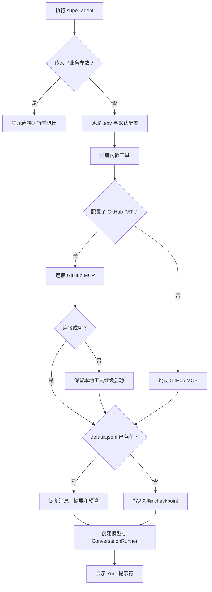
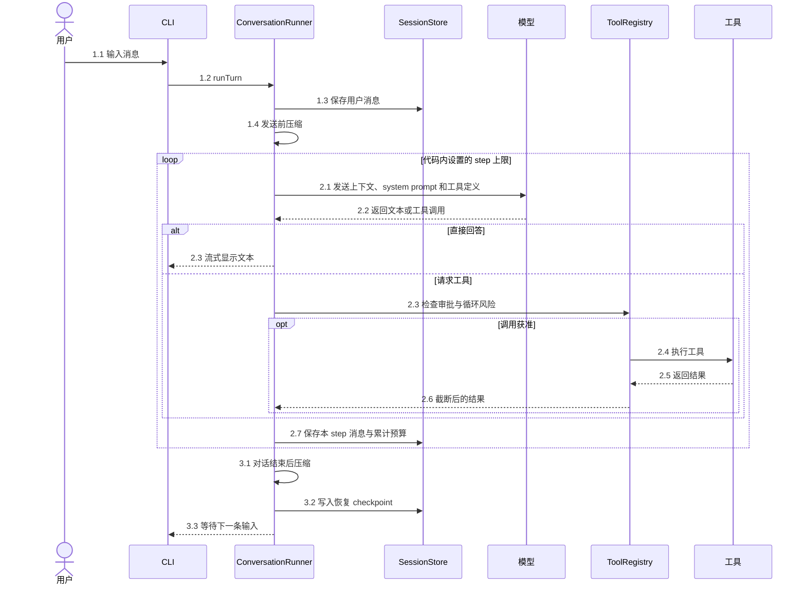
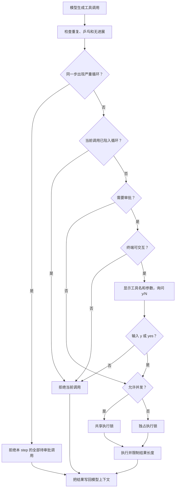
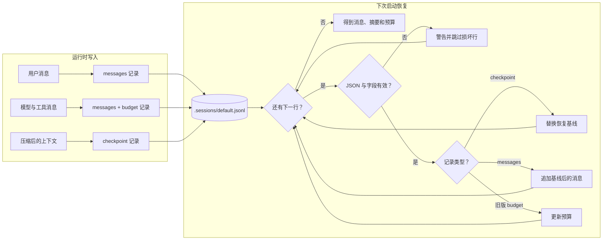
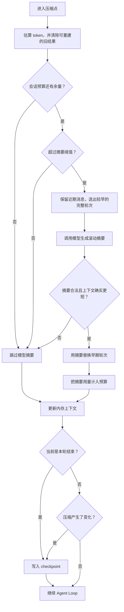
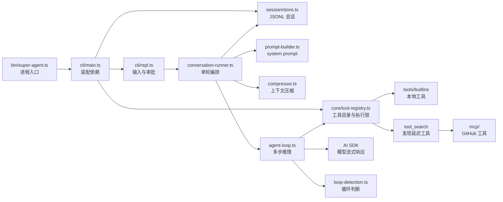

# Super-Agent

运行 `super-agent`，终端就会出现聊天提示符。它是一个 TypeScript Agent Demo，代码重点只有四件事：模型如何连续调用工具、危险操作如何审批、上下文如何缩短、会话如何恢复。

## 跑起来

需要 Node.js 20+ 和 pnpm。

```bash
pnpm install
cp .env-example .env
pnpm dev
```

PowerShell 复制配置文件时，把第二行换成 `Copy-Item .env-example .env`。

打开 `.env`，至少填入 `OPENAI_API_KEY`。默认接口是 DeepSeek 的 OpenAI-compatible API；使用其他兼容服务时，同时修改 `MODEL_BASE_URL` 和 `MODEL_ID`。

要安装成全局命令：

```bash
pnpm build
pnpm link --global
super-agent
```

CLI 不需要任何参数。进入聊天后：

- 输入普通文本开始对话。
- 输入 `exit`，关闭工具资源并退出。
- 审批提示中只有 `y` 或 `yes` 表示同意，其他输入都按拒绝处理。
- 第一次 `Ctrl+C` 会提示确认；1.5 秒内再按一次会强制退出。

启动时需要装配工具并恢复会话，完整分支如下。



Session 就是保存下来的对话。首次启动会创建 `.sessions/default.jsonl`，以后在同一目录运行会自动接着聊。

## 一轮对话发生了什么

用户消息会先落盘，再发送给模型。一次模型请求算一个 step；即使请求失败，刚才的输入仍留在 session 中。



模型返回工具调用时，Agent 会把结果放回上下文，再请求下一步。没有工具调用、预算耗尽、检测到循环或达到最大 step 数时，本轮结束。

## 工具与审批

内置工具分三组：

| 类型 | 工具 | 是否询问 |
| --- | --- | --- |
| 读取与计算 | `read_file`、`list_directory`、`glob`、`grep`、`fetch_url`、`calculator`、`get_weather` | 通常不询问 |
| 修改与进程 | `write_file`、`edit_file`、`bash`、`start_preview` | 每次询问 |
| 延迟工具 | `tool_search` 搜索到的 GitHub MCP 工具 | 每次询问 |

`get_weather` 使用代码里的演示数据，不是实时天气服务。MCP 工具缺少可信的读写标记，因此统一按可写工具处理。

是否弹出审批与是否并发是两套判断：`requiresApproval` / `isReadOnly` 决定审批，`isConcurrencySafe` 决定执行锁。



拒绝也会产生正式的工具结果，模型能看到“没有执行”以及原因，不会把拒绝误认为工具故障。

## Session 如何保存和恢复

Session 保存在 JSONL 文件里，每行是一条记录，只往文件末尾追加。Checkpoint 是恢复快照，启动时以最新快照为基线，再接上它后面的消息。



每轮结束一定写 checkpoint；发送模型前或 step 之间发生有效压缩时，也会立刻补一个 checkpoint。损坏的单行会被跳过，其他有效记录仍可恢复。

这个存储没有多进程写锁。同一个 session 只能让一个 CLI 进程写入。

## 上下文为什么不会一直变长

压缩在三个位置运行：发送用户消息前、两个工具 step 之间、本轮结束后。



第一层清理不调用模型，预算用完后仍可执行。第二层摘要会消耗 token，只有结果短于原上下文时才会替换消息。

## 代码从哪里读

下面这张图对应实际调用方向。



想改某个行为，直接从对应文件开始：

| 要修改的内容 | 入口 |
| --- | --- |
| CLI 启动和默认 session | `src/cli/main.ts` |
| 终端输出、审批和退出 | `src/cli/repl.ts` |
| 一轮对话的持久化顺序 | `src/agent/conversation-runner.ts` |
| step、重试、预算和工具调用 | `src/agent/agent-loop.ts` |
| 循环判断规则 | `src/agent/loop-detection.ts`、`src/agent/loop-detection.md` |
| 压缩策略 | `src/context/compressor.ts` |
| 工具定义和工作区边界 | `src/tools/`、`src/core/workspace.ts` |
| Session 文件格式 | `src/session/store.ts` |

## 配置

通常只需要修改前三项。

| 变量 | 默认值 | 用途 |
| --- | --- | --- |
| `OPENAI_API_KEY` | 无 | 模型服务密钥 |
| `MODEL_BASE_URL` | `https://api.deepseek.com` | OpenAI-compatible 接口地址 |
| `MODEL_ID` | `deepseek-v4-flash` | 模型名称 |
| `SUPER_AGENT_WORKSPACE` | 当前目录 | 文件、Shell 和预览工具的根目录 |
| `GITHUB_PERSONAL_ACCESS_TOKEN` | 无 | 配置后接入 GitHub MCP |
| `TOKEN_BUDGET` | `1000000` | 当前 session 的累计 token 上限 |

模型 step、重试和上下文压缩都属于代码内部策略，不通过环境变量配置。对应默认值分别位于 `src/agent/agent-loop.ts` 和 `src/context/compressor.ts`。

设置 `PROMPT_DEBUG=1` 可以打印 system prompt 每个组成部分的开关状态和字符数。

## 开发检查

```bash
pnpm check
pnpm build
```

`pnpm check` 会先做类型检查，再运行测试。源码调试使用 `pnpm debug`，然后从 IDE 或 `chrome://inspect` 连接 Node Inspector。

## 安全边界

- 文件工具只能访问 `SUPER_AGENT_WORKSPACE`，并检查路径和符号链接是否越界。
- `fetch_url` 只接受公网 HTTP(S) 地址，会拦截本地、私网、异常端口、超大响应和过多重定向。
- `bash` 虽然需要审批，但获批后拥有当前 Node 进程的系统权限；审批不是沙箱。
- 工具输出、文件大小、搜索范围和 Shell 运行时间都有上限，目的是避免 Demo 失控。
- 外部工具可能在“副作用已发生、结果尚未写入”时失败，所以这里不保证 exactly-once。

这套边界适合阅读和实验，不适合直接当作不可信代码的隔离环境。
