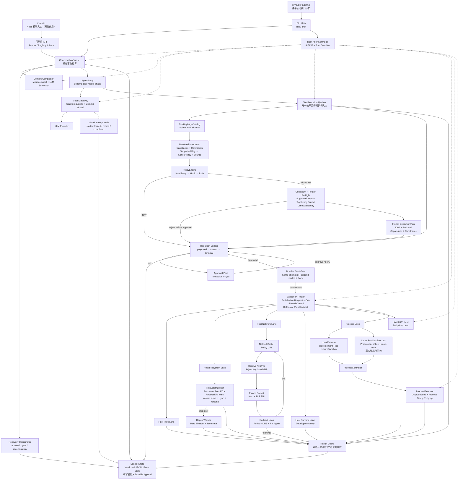

# Super-Agent

一个刻意保持小体量、但逐步补齐生产边界的 TypeScript Agent 内核。当前 M3 PR10 已实现 Linux Sandbox、Filesystem/Network Broker 与正则 worker 的代码边界，但目标 Linux 真实集成尚未验收；它不是平台化框架，也尚未宣称 production-ready。

## 快速开始

```bash
pnpm install
pnpm build
pnpm link --global
super-agent --help
```

Session 单写者使用原生内核文件锁。源码安装需要 Python 与 C/C++ 编译工具链；锁语义面向本机文件系统，不支持把 session 目录放在 NFS 等远程文件系统上。

首次运行前从 `.env-example` 创建 `.env`：macOS/Linux 使用 `cp .env-example .env`，PowerShell 使用 `Copy-Item .env-example .env`。

包提供两套互不混淆的入口：

- `super-agent`：真正的可执行 CLI。`package.json#bin` 由 npm/pnpm 在 macOS、Linux 生成 POSIX shim，在 Windows 生成 `.cmd`/PowerShell shim。
- `import { ... } from 'super-agent'`：无启动副作用的 Node 模块入口，类型声明位于 `dist/index.d.ts`。

CLI 包含两个子命令：

```bash
super-agent chat
super-agent chat --continue --session <session-id>
super-agent run "只回复 OK"
super-agent run --prompt "只回复 OK"
super-agent run "执行可信的写操作" --yes
```

不希望全局 link 时，可以使用开发入口 `pnpm cli -- chat`，或在构建后直接运行 `node dist/bin/super-agent.js run "任务"`。

`run` 提供稳定的退出码，适合脚本、CI 和其他进程调用；`chat` 使用 Node `readline` 进入交互模式。两者共用同一个对话编排器。会话状态已经由 JSONL 持久化，因此跨平台核心运行不依赖 tmux。仅在 macOS/Linux 需要人工挂后台或随时接回终端时，可以把 tmux 作为外层托管：

```bash
tmux new-session -s super-agent 'super-agent chat --continue --session <session-id>'
```

`run` 不会等待交互审批。`--yes` 只会自动批准 Policy 返回的 `ask`，不能越过 hard deny、执行约束、耐久账本或沙箱要求。当前 `bash` 按最坏情况声明 filesystem、process、network 与 secret 能力，会在 preflight 前被外传 hard deny；即使配置 production Sandbox 或传入 `--yes` 也不会执行。

## 开发与调试

日常开发直接通过 `tsx` 执行源码，不需要先 build：

```bash
pnpm dev -- chat
pnpm dev -- run "只回复 DEV_OK"
```

需要断点调试时启动 Node Inspector，然后在 IDE 或 `chrome://inspect` 中连接 9229 端口：

```bash
pnpm debug -- chat
pnpm debug -- run "调试任务"
```

全局 link 的 `super-agent` 指向 `dist/bin/super-agent.js`。源码变化后可以手动执行一次 `pnpm build`，或者在一个终端持续编译、另一个终端按需重新执行 CLI：

```bash
# 终端 1：仅编译，不自动重跑 Agent
pnpm build:watch

# 终端 2
super-agent run "测试最新构建"
```

这里刻意不对 Agent 进程做保存即重启：`run` 可能产生模型费用或外部写操作，自动重放并不安全。通过 npm/pnpm 安装的非 link 版本也不会跟随本地源码变化，需要重新 build、打包并安装新版本。

质量检查：

```bash
pnpm typecheck
pnpm test
pnpm build
```

当前 M1 可靠性验收在 POSIX 平台包含 11 个真实子进程 `SIGKILL` 注入点；Windows 会显式跳过这组用例。它们覆盖 `proposed`、`approved`、`started` write/datasync、dispatch、副作用、terminal、tool-result 与 checkpoint 之间的崩溃窗口，并在 fresh writer 上重复恢复以验证无静默重放和结果物化幂等。

M2 完成时全量 `pnpm check` 为 173/173，`typecheck`、`build` 与 diff check 均通过。2026-07-15 的非 CI 真实 Key E2E 使用合成 `.env.synthetic`：敏感读取的模型、终端与 journal 结果均为 `[REDACTED]`；下一 step 的 `fetch_url` 在 `proposed` 后由 Policy 拒绝，未进入 `approved/started` 或工具 closure。真实 Key 未记录，临时 fixture 与 session 已清理。

M3 PR9 完成时全量 `pnpm check` 为 185/185。production profile 在当前 macOS 上通过 `pnpm start` 实测为 `sandbox_platform_unsupported`、退出码 1，且在 MCP、Session 和 Provider 初始化前停止，没有创建 session；development profile 使用 `.env` 中真实 Key 完成 Provider → `calculator` → Router → durable operation → Provider 的两 step CLI 链路。GitHub 托管 MCP 的 44 个真实 schema 也完成 strict 编译验证；验证不打印 Key，临时 session 已清理。

M3 PR10 当前全量检查为 226 tests、221 pass、5 skip、0 fail，typecheck 通过；5 项均为本机 macOS 无法执行的 Linux-only `/proc/self/fd`、bwrap、seccomp、cgroup 真实集成。因此 PR10 代码边界已实现，但不能据此把 M3 标记完成，仍需在目标 Linux 环境运行真实 integration gate。

2026-07-15 的非 CI 真实 Key E2E 使用 development profile 和 `.env` Provider，真实注册 GitHub MCP 44 个工具；模型先调用 `fetch_url(https://example.com/)`，自动批准后经 pinned NetworkBroker 返回 Example Domain，再在第二 step 输出标题，Operation journal 为 `succeeded`。production profile 在同一台 macOS 上复验为退出码 1、`sandbox_platform_unsupported`，且未创建 session。全过程未打印 Key，临时 session 与 lock 已清理。

## 运行链路



一轮对话按以下顺序执行：

1. 用户消息先写入 append-only JSONL，再进入内存上下文。
2. 发送模型前执行压缩；若上下文或预算发生变化，立即写 checkpoint。
3. `AgentLoop` 每个 step 都重建 system prompt 和活跃工具集合；ModelGateway 集中处理稳定 requestId、deadline 和 retry。
4. text delta 或完整 tool call 一旦对用户可见，当前 attempt 失败时不再整体重试；每次 attempt 写入脱敏审计事件。
5. 完整 assistant response 先写入 journal；持久化失败时不创建 operation、不执行工具。
6. Pipeline 严格校验输入，并只解析一次冻结的 resolved snapshot：capabilities、constraints、supported constraint keys、并发属性与结构化 tool source；Policy、Ledger、锁和执行共用该快照。
7. Policy 按 hard deny → Hook → typed rule 固定顺序执行，约束只能求交收紧；只有 `ask` 进入人工审批，`--yes` 也不能批准 `deny`。
8. Policy 的非 `deny` 决策先经过 Constraint 与 Router Preflight，冻结包含 execution kind、backend、capabilities 与 constraints 的 `ExecutionPlan`；随后统一写入 `proposed`。Policy deny 或预检拒绝直接进入 `denied`，不会触发人工审批；`allow` 或获批的 `ask` 才写入 `approved`。
9. Pipeline 在执行前生成唯一 `attemptId`；同一个值进入 durable `started`、可序列化 `ExecutionRequest` 和 `ToolExecutionContext`。只有获得 fsync ack 才允许 Router dispatch，dispatch 前再次防御性复核冻结计划；`AbortSignal` 通过独立 `ExecutionControl` 传递，不混入 JSON 请求。
10. 只有 resolved 动态并发属性为安全的工具才可并行；写工具、bash 和未知 MCP 默认串行。
11. terminal event 立即持久化并物化恰好一条 tool-result；未知结果进入 `uncertain`，不会伪造失败结果或继续模型 step。
12. root signal 和 absolute deadline 贯穿模型、摘要、审批、锁、Pipeline、Router、Web、MCP 与子进程；dispatch 前取消落 `cancelled`，durable `started` 后未知结果落 `uncertain`。
13. 下一 step 前再次压缩；Agent Loop 结束后执行最后一次压缩并写恢复 checkpoint。

因此，会话文件同时保留两种视图：原始 `messages` 事件用于审计，最新 checkpoint 用于恢复压缩后的工作上下文。旧版分离的 `message`/`budget` JSONL 仍可继续读取。

## 上下文压缩

压缩分两层：

- Microcompact：清除较旧且可重建的读取/搜索类工具结果，保留写入和编辑结果。
- LLM Summary：超过阈值后，把旧的完整用户轮次滚动合并为结构化摘要，保留最近消息。

压缩会在 `before-turn`、`between-steps`、`after-turn` 三个时机运行。摘要调用也计入预算；预算耗尽后仍允许免费的 Microcompact，但不再发起摘要模型请求。摘要只有在合法、未超长且确实缩小上下文时才会替换原消息。

## 目录职责

| 目录/文件 | 职责 |
| --- | --- |
| `src/index.ts` | 无副作用的 Node 模块入口，集中导出稳定 API |
| `src/bin/super-agent.ts` | CLI 可执行入口、dotenv 加载和进程退出码 |
| `src/cli/main.ts` | Composition Root，装配配置、模型、工具和会话 |
| `src/agent/conversation-runner.ts` | 对话轮次编排、压缩时机、持久化边界 |
| `src/agent/agent-loop.ts` | 多 step 推理、重试、审批、预算和事件通知 |
| `src/agent/loop-detection.ts` | 每次 Agent Loop 独立的重复、乒乓和无进展检测 |
| `src/context/` | Prompt 组装与上下文压缩 |
| `src/core/tool-registry.ts` | 公开只读工具 Catalog、严格 schema 校验、resolved snapshot 与资源生命周期；不公开 dispatch |
| `src/execution/` | Operation Ledger、Pipeline/Router、Linux Sandbox、Filesystem/Network Broker、正则 worker、恢复与对账 |
| `src/security/` | 动态能力、可执行约束、typed policy rules 与 hard-deny 外传门禁 |
| `src/core/workspace.ts` | 文件工具的工作区路径与 symlink 边界 |
| `src/session/store.ts` | 版本化 append-only JSONL、单写者锁、durable append 和 checkpoint 恢复 |
| `src/tools/` | 内置工具和真实 MCP 工具的延迟发现 `tool_search` |
| `src/mcp/` | GitHub 托管 Streamable HTTP MCP 客户端 |
| `src/cli/` | 子命令解析、run/chat 执行、终端展示和人工审批 |

## 配置

所有运行参数都集中由 `src/core/config.ts` 校验。主要环境变量如下：

| 变量 | 默认值 | 说明 |
| --- | --- | --- |
| `OPENAI_API_KEY` | 无 | OpenAI-compatible Provider 密钥 |
| `MODEL_BASE_URL` | `https://api.deepseek.com` | Provider Base URL |
| `MODEL_ID` | `deepseek-v4-flash` | 模型 ID |
| `TOKEN_BUDGET` | `1000000` | 会话累计 token 上限 |
| `AGENT_MAX_STEPS` | `15` | 单轮最大 step 数 |
| `AGENT_MAX_RETRIES` | `10` | 每个模型请求的重试次数，可为 0 |
| `AGENT_TURN_TIMEOUT_MS` | `120000` | 单轮总墙钟上限，形成贯穿模型、审批和工具的 absolute deadline |
| `MODEL_REQUEST_TIMEOUT_MS` | `60000` | 单次模型 request 的上限，同时受 turn deadline 约束 |
| `CONTEXT_TOKEN_THRESHOLD` | `12000` | 触发摘要的估算 token 阈值 |
| `CONTEXT_KEEP_RECENT_MESSAGES` | `8` | 摘要后保留的最近消息数目标 |
| `CONTEXT_KEEP_RECENT_TOOL_MESSAGES` | `4` | 不做 Microcompact 的最近工具消息数 |
| `CONTEXT_MAX_SUMMARY_CHARS` | `1200` | 摘要最大字符数 |
| `SUPER_AGENT_WORKSPACE` | 当前目录 | 文件、Shell 和预览工具的工作区 |
| `SUPER_AGENT_AUTO_APPROVE` | `false` | 自动批准 Policy 的 `ask`；不能越过 hard deny 与执行约束 |
| `SUPER_AGENT_EXECUTION_PROFILE` | `development` | `development` 使用 Local process backend；`production` 只接受 Sandbox backend |
| `SUPER_AGENT_BWRAP_PATH` | `/usr/bin/bwrap` | production Linux 的可信 bwrap 绝对路径 |
| `SUPER_AGENT_SANDBOX_ROOTFS` | 无 | root-owned、不可写的 sandbox rootfs 绝对路径 |
| `SUPER_AGENT_SANDBOX_SECCOMP_PROFILE` | 无 | seccomp BPF profile 绝对路径 |
| `SUPER_AGENT_SANDBOX_SECCOMP_SHA256` | 无 | seccomp profile 的 64 位小写 SHA-256 |
| `SUPER_AGENT_SANDBOX_CGROUP_ROOT` | 无 | 当前进程所在有界 cgroup v2 的可信根目录 |
| `SUPER_AGENT_SANDBOX_MAX_MEMORY_BYTES` | `1073741824` | shared cgroup 允许的最大 `memory.max` |
| `SUPER_AGENT_SANDBOX_MAX_PIDS` | `64` | shared cgroup 允许的最大 `pids.max` |
| `SUPER_AGENT_SANDBOX_MAX_CPU_MICROS_PER_SECOND` | `1000000` | shared cgroup 每秒允许的最大 CPU quota |
| `GITHUB_PERSONAL_ACCESS_TOKEN` | 无 | GitHub MCP 的 PAT；未配置时不接入 |

配置 PAT 后直接连接 GitHub 官方托管的远程 MCP，不启动本地 MCP 进程，也不需要安装任何 binary。缺少可信能力元数据的 MCP 工具按 `network.egress + external.write`、串行、需审批处理，并绑定 endpoint 的 scheme、host 和 port；Policy 使用结构化 server identity，不从工具名称猜测来源。

## 安全与工程边界

已实现的边界包括：

- 文件读写限制在显式 workspace 内；敏感文件按 canonical realpath 分类，因此 symlink 不能隐藏 `.env`、SSH、云凭据、macOS Keychain 或常见 token 文件。目录 glob/grep 默认过滤敏感候选，显式敏感读取追加 `secret.read`。
- Preview 每个 HTTP 请求重新解析 realpath，并在读取前对敏感目标或敏感 symlink 返回 `403`。
- 全部内置文件工具通过 FilesystemBroker。production Linux 启动时持有 workspace root FD，并逐级经 `/proc/self/fd` 打开目录、拒绝 symlink/hardlink 越界；最终文件以 `O_NONBLOCK` 打开并在 I/O 前拒绝 FIFO/device 等特殊类型。写入使用同目录临时文件、文件 `fsync`、原子 rename 和目录 `fsync`。该协议保证耐久原子替换，但不是跨进程 compare-and-swap；同 UID 并发写者仍需上层单写者协议。
- Web 请求通过 NetworkBroker：先验证 policy scheme/host/port，再解析全部 DNS answer；IPv6 仅接受当前 global-unicast `2000::/3`，任一 special/private/loopback/link-local/metadata 地址都会拒绝。实际 socket 固定到已验证 IP，同时保留 HTTP Host 与 TLS SNI；每一跳 redirect 都重新执行 policy → DNS → pinned dial。
- 同一调用或 batch 的 `secret.read + network.egress` 会 hard deny；会话中已经成功的敏感读取也会阻止后续网络外传。旧 journal 的 `legacy.read` 保守映射为 `secret.read`。
- `secret.read` 的工具结果按能力整体替换为 `[REDACTED]`，不进入模型上下文、终端 observer 或 durable journal；带供应商/环境前缀的常见 secret 字段也会被通用结果守卫识别。
- Constraint Gate 与 Router Preflight 冻结 capabilities、constraints、execution kind 和 backend；审批、durable start 与 dispatch 使用同一 `ExecutionPlan`，dispatch 前再次防御性复核。
- production process backend 使用 Linux bwrap：rootfs 与 workspace 均只读，workspace 通过 `--ro-bind-fd` 锚定；清空环境、隔离 user/PID/IPC/UTS/network/cgroup namespace、drop capabilities、`no-new-privileges`，并使用有界 tmpfs。seccomp profile 每次打开后校验 digest，启动探针还运行 immutable rootfs 中的固定 helper 验证禁用 syscall。CPU、memory、PID 与 FD 边界来自当前进程已加入的 shared bounded cgroup，并以全局 single-flight 避免并发争用；当前 lane 仅支持 offline、read-only process。
- Shell 按最坏情况声明 filesystem、process、network 和 secret 能力，会触发外传 hard deny；当前 `bash` 仍禁用，`--yes` 不能绕过。Preview 带 `process.execute` 却位于 host preview lane，production 同样在 preflight 拒绝。
- `glob` 使用受限的字面路径、`*`、`**`、`?` 语法，并以独立 1 秒 hard deadline 同时约束 Broker walk 与同步匹配；`grep` 在独立 worker thread 中编译和执行 ECMAScript RegExp，灾难性回溯由 hard timeout/AbortSignal 直接 terminate，输入、匹配数、行长、worker heap/stack 和结果均有上限，所有路径等待 worker 退出。
- 未知 MCP 默认声明 `network.egress + external.write`，绑定 endpoint origin、拒绝 HTTP redirect、串行执行并要求审批。
- GitHub token 只发送到代码中固定的官方 HTTPS MCP 地址。
- 工具结果长度、文件大小、搜索文件数和匹配数均有上限。
- Session journal 使用固定 lock inode 上的内核单写者锁、单调事件序号、`0700/0600` 权限和显式 durable append；旧版无版本 JSONL 仍可恢复。
- 每轮取消与 deadline 贯穿模型、摘要、审批、锁、Web、MCP 和工具；POSIX Shell 取消/超时会回收独立进程组，Windows 当前仅保证直接子进程终止。

PR10 尚未完成目标环境验收：当前开发机是 macOS，Linux `/proc/self/fd`、bwrap、seccomp fixed-helper 与 cgroup 的真实 integration 测试均跳过。只读 workspace 的 FD 锚定防止顶层 pathname 被替换，但不会冻结子树内容；同 UID 进程可在检查后修改子项，强快照语义仍需 staging/snapshot。当前 cgroup 是 agent 进程继承的 shared bound，不是 per-operation cgroup，尚未隔离 Agent 自身或校验 `memory.swap.max`。seccomp helper 源码、canonical BPF 制品和项目认可 digest 也尚未纳入仓库；单一禁用 syscall 探针不能证明完整策略。Regex worker 仍使用 ECMAScript RegExp，而非线性时间 RE2。上述边界在目标 Linux 验收前均不能扩大宣称为 M3 完成或 production-ready。

循环检测的细节见 [`src/agent/loop-detection.md`](src/agent/loop-detection.md)。

从当前 Demo 骨架演进到单机生产 Agent 内核的目标架构、里程碑和验收门槛，见 [`docs/production-agent-spec.md`](docs/production-agent-spec.md)。
