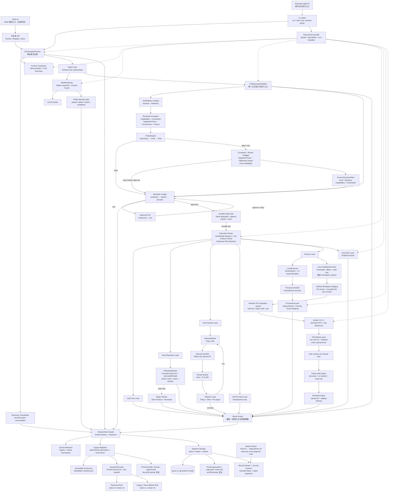

# Super-Agent

一个刻意保持小体量、但逐步补齐生产边界的 TypeScript Agent 内核。M4 PR11B 已完成
layout-v1 Session 分段存储、legacy fence 迁移、rotation、regular/critical quota 与跨段 doctor；
M3 PR10B 的固定 `workspace_inspect`、verified staging、per-operation cgroup 与 crash-safe bwrap
握手保持不变。x86_64 目标内核、真实 systemd/OOM crash attestation 与主机掉电耐久仍待发布
环境验收；它不是平台化框架，也尚未宣称 production-ready。

## 快速开始

```bash
pnpm install
pnpm build
pnpm link --global
super-agent --help
```

Session 单写者使用原生内核文件锁。layout v1 把事件保存到 immutable generation 下的
active/sealed segments，旧 `<id>.jsonl` 只保留一个精确的 migration fence；manifest 是
可重建缓存，不能作为 sequence、Operation projection 或 quota 的事实来源。源码安装需要
Python 与 C/C++ 编译工具链；锁语义面向本机文件系统，不支持把 session 目录放在 NFS 等
远程文件系统上。

首次运行前从 `.env-example` 创建 `.env`：macOS/Linux 使用 `cp .env-example .env`，PowerShell 使用 `Copy-Item .env-example .env`。这适合 development；production 必须把 Provider Key/EnvironmentFile 放在 workspace 外，并令 `SUPER_AGENT_WORKSPACE` 指向不含 `.env`、凭据、symlink、hardlink 或特殊文件的独立目录。

包提供两套互不混淆的入口：

- `super-agent`：真正的可执行 CLI。`package.json#bin` 由 npm/pnpm 在 macOS、Linux 生成 POSIX shim，在 Windows 生成 `.cmd`/PowerShell shim。
- `import { ... } from 'super-agent'`：无启动副作用的 Node 模块入口，类型声明位于 `dist/index.d.ts`。

CLI 包含四类命令：

```bash
super-agent chat
super-agent chat --continue --session <session-id>
super-agent run "只回复 OK"
super-agent run --prompt "只回复 OK"
super-agent run "执行可信的写操作" --yes
super-agent ops list --session <session-id>
super-agent session doctor --session <session-id>
```

不希望全局 link 时，可以使用开发入口 `pnpm cli -- chat`，或在构建后直接运行 `node dist/bin/super-agent.js run "任务"`。

`run` 提供稳定的退出码，适合脚本、CI 和其他进程调用；正常完成为 0，被 `SIGINT`/`SIGTERM` 取消分别为 130/143，flush 或资源关闭失败为 1。`chat` 使用 Node `readline` 进入交互模式：active turn 上第一次 `SIGINT` 只取消当前 turn 并保留 REPL，空闲时 `SIGINT` 或任意时刻 `SIGTERM` 才进入完整关停；关停中的第二次 `SIGINT` 以 130 强制退出。两者共用同一个对话编排器。会话状态已经由 JSONL 持久化，因此跨平台核心运行不依赖 tmux。仅在 macOS/Linux 需要人工挂后台或随时接回终端时，可以把 tmux 作为外层托管：

```bash
tmux new-session -s super-agent 'super-agent chat --continue --session <session-id>'
```

`run` 不会等待交互审批。`--yes` 只会自动批准 Policy 返回的 `ask`，不能越过 hard deny、执行约束、耐久账本或沙箱要求。当前 `bash` 按最坏情况声明 filesystem、process、network 与 secret 能力，会在 preflight 前被外传 hard deny；即使配置 production Sandbox 或传入 `--yes` 也不会执行。

## 开发与调试

日常开发直接通过 `tsx` 执行源码，不需要先 build：

```bash
pnpm dev -- chat
pnpm dev -- run "只回复 DEV_OK"
```

需要断点调试时启动 Node Inspector，然后在 IDE 或 `chrome://inspect` 中连接 9229 端口：

```bash
pnpm debug -- chat
pnpm debug -- run "调试任务"
```

全局 link 的 `super-agent` 指向 `dist/bin/super-agent.js`。源码变化后可以手动执行一次 `pnpm build`，或者在一个终端持续编译、另一个终端按需重新执行 CLI：

```bash
# 终端 1：仅编译，不自动重跑 Agent
pnpm build:watch

# 终端 2
super-agent run "测试最新构建"
```

这里刻意不对 Agent 进程做保存即重启：`run` 可能产生模型费用或外部写操作，自动重放并不安全。通过 npm/pnpm 安装的非 link 版本也不会跟随本地源码变化，需要重新 build、打包并安装新版本。

质量检查：

```bash
pnpm typecheck
pnpm test
pnpm build
```

当前 M1 可靠性验收在 POSIX 平台包含 11 个真实子进程 `SIGKILL` 注入点；Windows 会显式跳过这组用例。它们覆盖 `proposed`、`approved`、`started` write/datasync、dispatch、副作用、terminal、tool-result 与 checkpoint 之间的崩溃窗口，并在 fresh writer 上重复恢复以验证无静默重放和结果物化幂等。

M2 完成时全量 `pnpm check` 为 173/173，`typecheck`、`build` 与 diff check 均通过。2026-07-15 的非 CI 真实 Key E2E 使用合成 `.env.synthetic`：敏感读取的模型、终端与 journal 结果均为 `[REDACTED]`；下一 step 的 `fetch_url` 在 `proposed` 后由 Policy 拒绝，未进入 `approved/started` 或工具 closure。真实 Key 未记录，临时 fixture 与 session 已清理。

M3 PR9 完成时全量 `pnpm check` 为 185/185。production profile 在当前 macOS 上通过 `pnpm start` 实测为 `sandbox_platform_unsupported`、退出码 1，且在 MCP、Session 和 Provider 初始化前停止，没有创建 session；development profile 使用 `.env` 中真实 Key 完成 Provider → `calculator` → Router → durable operation → Provider 的两 step CLI 链路。GitHub 托管 MCP 的 44 个真实 schema 也完成 strict 编译验证；验证不打印 Key，临时 session 已清理。

M3 PR10 的历史基线为 226 tests、221 pass、5 个 macOS 上的 Linux-only skip；该 shared-cgroup/no-staging 边界已由 PR10B 取代。

2026-07-16 的 PR10B 非 CI 验收结果：宿主普通套件为 281 tests、271 pass、10 个平台 skip、0 fail；aarch64（OCI 平台名 linux/arm64）的 non-skippable `pnpm test:linux-release` 为 1/1 pass，另有 46 项 Linux 专项测试为 45 pass、1 个 Darwin-only 预期 skip。2026-07-15 的同阶段真实 Key production E2E 通过 `pnpm start` 完成 Provider → Policy/Approval → durable Ledger → Router → Sandbox → 固定 `workspace_inspect` helper，两 step 后 Operation 为 `succeeded`，cgroup/staging 无残留。Key 未输出，未进入 workspace、rootfs 或 journal，临时 session 已清理。

2026-07-16 的 PR11A 非 CI 验收结果：最终 `pnpm check` 为 344 tests、334 pass、10 个平台 skip、0 fail，PR11A 定向矩阵为 92/92，`pnpm build`、diff check 与 deterministic seccomp artifact 2/2 均通过。使用 `.env` 中真实 Provider Key 的 `pnpm start` 依次完成 create → clean close → doctor → continue → doctor；两个固定模型标记均返回，doctor 从 6 条记录到 11 条记录都为 `healthy`。值级扫描检查 2 个 `.env` secret value，journal 命中数为 0，命令输出未显示 Key。该证据只证明 Provider、Ledger、Store、close/reopen 和 doctor 装配，不证明 rotation、quota、主机掉电或混合版本滚动升级。

2026-07-17 的 PR11B 非 CI 验收结果：PR11B 定向矩阵 185/185；最终 `pnpm check` 为
447 tests、437 pass、10 个平台 skip、0 fail，build、diff check 与 deterministic seccomp
artifact 2/2 通过。真实子进程 `SIGKILL` 覆盖 migration 12 点、
rotation 5 点，既有 11 点 Operation crash matrix 在极小 segment target 下通过。使用 `.env`
中的真实 Provider Key 和 512-byte target 完成 create → close → doctor → continue → doctor，
两个固定标记均返回，doctor 记录数 6→11 且均 healthy，共产生 10 个 segment。值级扫描检查
2 个 secret value，在输出、diagnostic、fence、segments、format、manifest 中均 0 命中，临时
session 已清理。该证据只证明进程崩溃恢复与真实装配，不是 target-Linux、OOM 或 power-loss
证明。

上述 sandbox 证据只认证当前 arm64 容器内核和 Provider 装配链。仓库中的 x86_64 BPF 仍是
candidate；`SUPER_AGENT_SANDBOX_CRASH_SUPERVISOR` 只是部署声明，尚需在真实 systemd
delegated unit 中注入 launcher/Agent `SIGKILL` 与 OOM，证明 `KillMode=control-group` 回收
整个 service subtree。M4 的 PR11B 已完成本地分段、quota 与 doctor 门禁；archive/retention
属于 PR11C，目标 Linux 生命周期与真实 power-loss 仍未完成。

## 运行链路



一轮对话按以下顺序执行：

1. 用户消息先写入 append-only JSONL，再进入内存上下文。
2. 发送模型前执行压缩；若上下文或预算发生变化，立即写 checkpoint。
3. `AgentLoop` 每个 step 都重建 system prompt 和活跃工具集合；ModelGateway 集中处理稳定 requestId、deadline 和 retry。
4. text delta 或完整 tool call 一旦对用户可见，当前 attempt 失败时不再整体重试；每次 attempt 写入脱敏审计事件。
5. 完整 assistant response 先写入 journal；持久化失败时不创建 operation、不执行工具。
6. Pipeline 严格校验输入，并只解析一次冻结的 resolved snapshot：capabilities、constraints、supported constraint keys、并发属性与结构化 tool source；Policy、Ledger、锁和执行共用该快照。
7. Policy 按 hard deny → Hook → typed rule 固定顺序执行，约束只能求交收紧；只有 `ask` 进入人工审批，`--yes` 也不能批准 `deny`。
8. Policy 的非 `deny` 决策先经过 Constraint 与 Router Preflight，冻结包含 execution kind、backend、capabilities 与 constraints 的 `ExecutionPlan`；随后统一写入 `proposed`。Policy deny 或预检拒绝直接进入 `denied`，不会触发人工审批；`allow` 或获批的 `ask` 才写入 `approved`。
9. Pipeline 在执行前生成唯一 `attemptId`；同一个值进入 durable `started`、可序列化 `ExecutionRequest` 和 `ToolExecutionContext`。只有获得 fsync ack 才允许 Router dispatch，dispatch 前再次防御性复核冻结计划；`AbortSignal` 通过独立 `ExecutionControl` 传递，不混入 JSON 请求。
10. 只有 resolved 动态并发属性为安全的工具才可并行；写工具、bash 和未知 MCP 默认串行。
11. terminal event 立即持久化并物化恰好一条 tool-result；未知结果进入 `uncertain`，不会伪造失败结果或继续模型 step。
12. root signal 和 absolute deadline 贯穿模型、摘要、审批、锁、Pipeline、Router、Web、MCP 与子进程；dispatch 前取消落 `cancelled`，durable `started` 后未知结果落 `uncertain`。
13. 下一 step 前再次压缩；Agent Loop 结束后执行最后一次压缩并写恢复 checkpoint。

因此，会话文件同时保留两种视图：原始 `messages` 事件用于审计，最新 checkpoint 用于恢复压缩后的工作上下文。旧版分离的 `message`/`budget` JSONL 仍可继续读取。

## 上下文压缩

压缩分两层：

- Microcompact：清除较旧且可重建的读取/搜索类工具结果，保留写入和编辑结果。
- LLM Summary：超过阈值后，把旧的完整用户轮次滚动合并为结构化摘要，保留最近消息。

压缩会在 `before-turn`、`between-steps`、`after-turn` 三个时机运行。摘要调用也计入预算；预算耗尽后仍允许免费的 Microcompact，但不再发起摘要模型请求。摘要只有在合法、未超长且确实缩小上下文时才会替换原消息。

## 目录职责

| 目录/文件 | 职责 |
| --- | --- |
| `src/index.ts` | 无副作用的 Node 模块入口，集中导出稳定 API |
| `src/bin/super-agent.ts` | CLI 可执行入口、dotenv 加载和进程退出码 |
| `src/cli/main.ts` | Composition Root，装配配置、模型、工具和会话 |
| `src/agent/conversation-runner.ts` | 对话轮次编排、压缩时机、持久化边界 |
| `src/agent/agent-loop.ts` | 多 step 推理、重试、审批、预算和事件通知 |
| `src/agent/loop-detection.ts` | 每次 Agent Loop 独立的重复、乒乓和无进展检测 |
| `src/context/` | Prompt 组装与上下文压缩 |
| `src/core/tool-registry.ts` | 公开只读工具 Catalog、严格 schema 校验、resolved snapshot 与资源生命周期；不公开 dispatch |
| `src/execution/` | Operation Ledger、Pipeline/Router、Linux Sandbox、Filesystem/Network Broker、正则 worker、恢复与对账 |
| `src/security/` | 动态能力、可执行约束、typed policy rules 与 hard-deny 外传门禁 |
| `src/core/workspace.ts` | 文件工具的工作区路径与 symlink 边界 |
| `src/session/store.ts` | Session 门面、事件顺序、projection、durable append 和 checkpoint 恢复 |
| `src/session/session-layout.ts` | deterministic generation、exact fence、immutable format 与 segment 命名协议 |
| `src/session/session-migration.ts` | legacy fingerprint、bundle staging/复验与双 secondary-lock fence handoff |
| `src/session/session-segment-storage.ts` | segment catalog、active/sealed rotation、EOF 修复与可重建 manifest |
| `src/session/session-quota.ts` | regular/critical batch admission 与 Operation reservation 全量恢复 |
| `src/session/session-record-stream.ts` | opaque JSONL 字节拆分、单记录边界与增量 SHA-256 fingerprint |
| `src/session/session-file-lease.ts` | 固定 descriptor、fixed→legacy/fence 双锁和 inode/path 安全校验 |
| `src/session/journal-scanner.ts` | 分块 JSONL 扫描、顺序校验和脱敏结构化诊断 |
| `src/session/doctor.ts` | 只读 shared-lock Session 诊断；不创建、不 chmod、不修复 |
| `src/tools/` | 内置工具和真实 MCP 工具的延迟发现 `tool_search` |
| `src/mcp/` | GitHub 托管 Streamable HTTP MCP 客户端 |
| `src/cli/` | 子命令解析、run/chat 执行、终端展示和人工审批 |

## 配置

所有运行参数都集中由 `src/core/config.ts` 校验。主要环境变量如下：

| 变量 | 默认值 | 说明 |
| --- | --- | --- |
| `OPENAI_API_KEY` | 无 | OpenAI-compatible Provider 密钥 |
| `MODEL_BASE_URL` | `https://api.deepseek.com` | Provider Base URL |
| `MODEL_ID` | `deepseek-v4-flash` | 模型 ID |
| `TOKEN_BUDGET` | `1000000` | 会话累计 token 上限 |
| `AGENT_MAX_STEPS` | `15` | 单轮最大 step 数 |
| `AGENT_MAX_RETRIES` | `10` | 每个模型请求的重试次数，可为 0 |
| `AGENT_TURN_TIMEOUT_MS` | `120000` | 单轮总墙钟上限，形成贯穿模型、审批和工具的 absolute deadline |
| `MODEL_REQUEST_TIMEOUT_MS` | `60000` | 单次模型 request 的上限，同时受 turn deadline 约束 |
| `SUPER_AGENT_SESSION_MAX_RECORD_BYTES` | `1048576` | 新写完整 JSONL record 上限，包含 LF；layout v1 immutable |
| `SUPER_AGENT_SESSION_MAX_READ_RECORD_BYTES` | `16777216` | 既有 record 兼容读取上限；layout v1 immutable |
| `SUPER_AGENT_SESSION_SEGMENT_TARGET_BYTES` | `16777216` | active segment soft rotation target；layout v1 immutable |
| `SUPER_AGENT_SESSION_REGULAR_QUOTA_BYTES` | `67108864` | 普通事件 soft quota；layout v1 immutable |
| `SUPER_AGENT_SESSION_CRITICAL_RESERVE_BYTES` | `16777216` | Operation 恢复义务与 critical event reserve；layout v1 immutable |
| `CONTEXT_TOKEN_THRESHOLD` | `12000` | 触发摘要的估算 token 阈值 |
| `CONTEXT_KEEP_RECENT_MESSAGES` | `8` | 摘要后保留的最近消息数目标 |
| `CONTEXT_KEEP_RECENT_TOOL_MESSAGES` | `4` | 不做 Microcompact 的最近工具消息数 |
| `CONTEXT_MAX_SUMMARY_CHARS` | `1200` | 摘要最大字符数 |
| `SUPER_AGENT_WORKSPACE` | 当前目录 | 文件、Shell 和预览工具的工作区 |
| `SUPER_AGENT_AUTO_APPROVE` | `false` | 自动批准 Policy 的 `ask`；不能越过 hard deny 与执行约束 |
| `SUPER_AGENT_EXECUTION_PROFILE` | `development` | `development` 使用 Local process backend；`production` 只接受 Sandbox backend |
| `SUPER_AGENT_BWRAP_PATH` | `/usr/bin/bwrap` | production Linux 的可信 bwrap 绝对路径 |
| `SUPER_AGENT_MKFIFO_PATH` | `/usr/bin/mkfifo` | 创建 self-held block FIFO 的可信 root-owned executable |
| `SUPER_AGENT_SANDBOX_ROOTFS` | 无 | root-owned、不可写的 sandbox rootfs 绝对路径 |
| `SUPER_AGENT_SANDBOX_SECCOMP_PROFILE` | 无 | seccomp BPF profile 绝对路径 |
| `SUPER_AGENT_SANDBOX_SECCOMP_SHA256` | 无 | seccomp profile 的 64 位小写 SHA-256 |
| `SUPER_AGENT_SANDBOX_CGROUP_ROOT` | 无 | process-free、已委派 cpu/memory/pids 的专用 cgroup v2 root；Agent 位于 sibling runtime leaf |
| `SUPER_AGENT_SANDBOX_CRASH_SUPERVISOR` | 无 | `systemd-control-group-v1` 或 `container-control-group-v1` 部署声明；声明本身不等于 crash attestation |
| `SUPER_AGENT_SANDBOX_MAX_MEMORY_BYTES` | `1073741824` | 每个 operation 的 `memory.max` |
| `SUPER_AGENT_SANDBOX_MAX_SWAP_BYTES` | `0` | 每个 operation 的 `memory.swap.max`；默认/release gate 为 0，可显式配置有界非零值 |
| `SUPER_AGENT_SANDBOX_MAX_PIDS` | `64` | 每个 operation 的 `pids.max` |
| `SUPER_AGENT_SANDBOX_MAX_CPU_MICROS_PER_SECOND` | `1000000` | 每个 operation 按 1 秒 period 归一化的 CPU quota |
| `SUPER_AGENT_SANDBOX_MAX_OPEN_FILES` | `4096` | 允许的 hard `RLIMIT_NOFILE` 上限；代码验证但不替 launcher 设置 |
| `SUPER_AGENT_SANDBOX_STAGING_PARENT` | 无 | production 必填；当前 UID 独占且 group/other 不可写的本地 staging 父目录，建议配 project quota |
| `SUPER_AGENT_SANDBOX_SNAPSHOT_MAX_FILES` | `10000` | 单次 verified staging 最大普通文件数 |
| `SUPER_AGENT_SANDBOX_SNAPSHOT_MAX_ENTRIES` | `20000` | 单次 staging 最大总 entry 数 |
| `SUPER_AGENT_SANDBOX_SNAPSHOT_MAX_TOTAL_BYTES` | `268435456` | 单次 staging 最大总字节数 |
| `SUPER_AGENT_SANDBOX_SNAPSHOT_MAX_FILE_BYTES` | `16777216` | staging 单文件最大字节数 |
| `SUPER_AGENT_SANDBOX_SNAPSHOT_MAX_DEPTH` | `64` | staging 最大目录深度 |
| `GITHUB_PERSONAL_ACCESS_TOKEN` | 无 | GitHub MCP 的 PAT；未配置时不接入 |

配置 PAT 后直接连接 GitHub 官方托管的远程 MCP，不启动本地 MCP 进程，也不需要安装任何 binary。缺少可信能力元数据的 MCP 工具按 `network.egress + external.write`、串行、需审批处理，并绑定 endpoint 的 scheme、host 和 port；Policy 使用结构化 server identity，不从工具名称猜测来源。

## 安全与工程边界

已实现的边界包括：

- 文件读写限制在显式 workspace 内；敏感文件按 canonical realpath 分类，因此 symlink 不能隐藏 `.env`、SSH、云凭据、macOS Keychain 或常见 token 文件。目录 glob/grep 默认过滤敏感候选，显式敏感读取追加 `secret.read`。
- Preview 每个 HTTP 请求重新解析 realpath，并在读取前对敏感目标或敏感 symlink 返回 `403`。
- 全部内置文件工具通过 FilesystemBroker。production Linux 启动时持有 workspace root FD，并逐级经 `/proc/self/fd` 打开目录、拒绝 symlink/hardlink 越界；最终文件以 `O_NONBLOCK` 打开并在 I/O 前拒绝 FIFO/device 等特殊类型。写入使用同目录临时文件、文件 `fsync`、原子 rename 和目录 `fsync`。该协议保证耐久原子替换，但不是跨进程 compare-and-swap；同 UID 并发写者仍需上层单写者协议。
- Web 请求通过 NetworkBroker：先验证 policy scheme/host/port，再解析全部 DNS answer；IPv6 仅接受当前 global-unicast `2000::/3`，任一 special/private/loopback/link-local/metadata 地址都会拒绝。实际 socket 固定到已验证 IP，同时保留 HTTP Host 与 TLS SNI；每一跳 redirect 都重新执行 policy → DNS → pinned dial。
- 同一调用或 batch 的 `secret.read + network.egress` 会 hard deny；会话中已经成功的敏感读取也会阻止后续网络外传。旧 journal 的 `legacy.read` 保守映射为 `secret.read`。
- `secret.read` 的工具结果按能力整体替换为 `[REDACTED]`，不进入模型上下文、终端 observer 或 durable journal；带供应商/环境前缀的常见 secret 字段也会被通用结果守卫识别。
- Constraint Gate 与 Router Preflight 冻结 capabilities、constraints、execution kind 和 backend；审批、durable start 与 dispatch 使用同一 `ExecutionPlan`，dispatch 前再次防御性复核。
- production process backend 只接受固定 `workspace_inspect` 语义输入，path/query 同时受字符数和 UTF-8 字节契约约束。活跃 workspace 先在当前 UID 独占的 private parent 下构造 `owner.json + payload/` 有界 verified copy，并做完整 source tree 二次复验；sandbox 只绑定只读 payload FD。请求的有效期限收敛为调用方 deadline 与 sandbox wall limit 的较小值，并贯穿 rootfs/workspace preflight。每个 operation 使用随机 cgroup，先写入并回读 memory/swap/PID/CPU/层级限制，再由自持 `O_RDWR` FIFO 保持 bwrap blocked。只有 host PID 的 bwrap executable identity、`/proc` starttime 与 exact `cgroup.procs` 均复核后才写一个 release byte。rootfs/workspace 只读，环境清空，user/PID/IPC/UTS/network/cgroup namespace 隔离，capability 全部 drop，seccomp 使用 versioned deterministic candidate 并运行完整 must-allow/must-deny startup probe。
- Shell 按最坏情况声明 filesystem、process、network 和 secret 能力，会触发外传 hard deny；当前 `bash` 仍禁用，`--yes` 不能绕过。Preview 带 `process.execute` 却位于 host preview lane，production 同样在 preflight 拒绝。
- `glob` 使用受限的字面路径、`*`、`**`、`?` 语法，并以独立 1 秒 hard deadline 同时约束 Broker walk 与同步匹配；`grep` 在独立 worker thread 中编译和执行 ECMAScript RegExp，灾难性回溯由 hard timeout/AbortSignal 直接 terminate，输入、匹配数、行长、worker heap/stack 和结果均有上限，所有路径等待 worker 退出。
- 未知 MCP 默认声明 `network.egress + external.write`，绑定 endpoint origin、拒绝 HTTP redirect、串行执行并要求审批。
- GitHub token 只发送到代码中固定的官方 HTTPS MCP 地址。
- 工具结果长度、文件大小、搜索文件数和匹配数均有上限。
- Session journal 的当前版本 writer 按 fixed lock → canonical journal 获取两个 lifetime exclusive flock，doctor 同序获取 shared flock，释放顺序相反；再配合固定 descriptor、单调事件序号、`0700/0600` 权限和显式 durable append。新记录限制为 1 MiB，旧记录使用独立的 16 MiB 有界兼容读取上限。`session doctor` 只读诊断，旧版无版本 JSONL 仍可恢复。PR11A 不支持旧二进制与新 writer 并行或滚动升级：必须先停掉全部旧 writer、运行 doctor，再启动新版本；旧程序无法理解新布局的 storage fence 留到 PR11B。
- 每轮取消与 deadline 贯穿模型、摘要、审批、锁、Web、MCP 和工具；POSIX Shell 取消/超时会回收独立进程组，Windows 当前仅保证直接子进程终止。

仍未关闭的发布边界：verified staging 不是原子文件系统 snapshot，也不抵御任意同 UID 恶意宿主进程；staging 发生在 operation cgroup 之前，仍依赖 service envelope、串行 admission 与宿主配额。seccomp manifest 当前状态是 `candidate-linux-release-gate-required`，必须分别在 aarch64/x86_64 目标内核执行并保存 attestation。probe 只能校验 crash supervisor 声明值，不能证明 systemd/OCI 真的回收过崩溃 service；真实部署必须做外部 `SIGKILL/OOM` 测试。memory/swap 的配置和回读已有测试，但当前公开 matrix 没有保存 OOM 的 `memory.events` 证明。Regex worker 仍使用受硬边界保护的 ECMAScript RegExp，而非线性时间 RE2。详见 [`docs/operations/linux-sandbox.md`](docs/operations/linux-sandbox.md)。

循环检测的细节见 [`src/agent/loop-detection.md`](src/agent/loop-detection.md)。

Session 诊断、信号关停和故障处理见 [`docs/operations/session-storage.md`](docs/operations/session-storage.md)。从当前 Demo 骨架演进到单机生产 Agent 内核的目标架构、里程碑和验收门槛，见 [`docs/production-agent-spec.md`](docs/production-agent-spec.md)。
