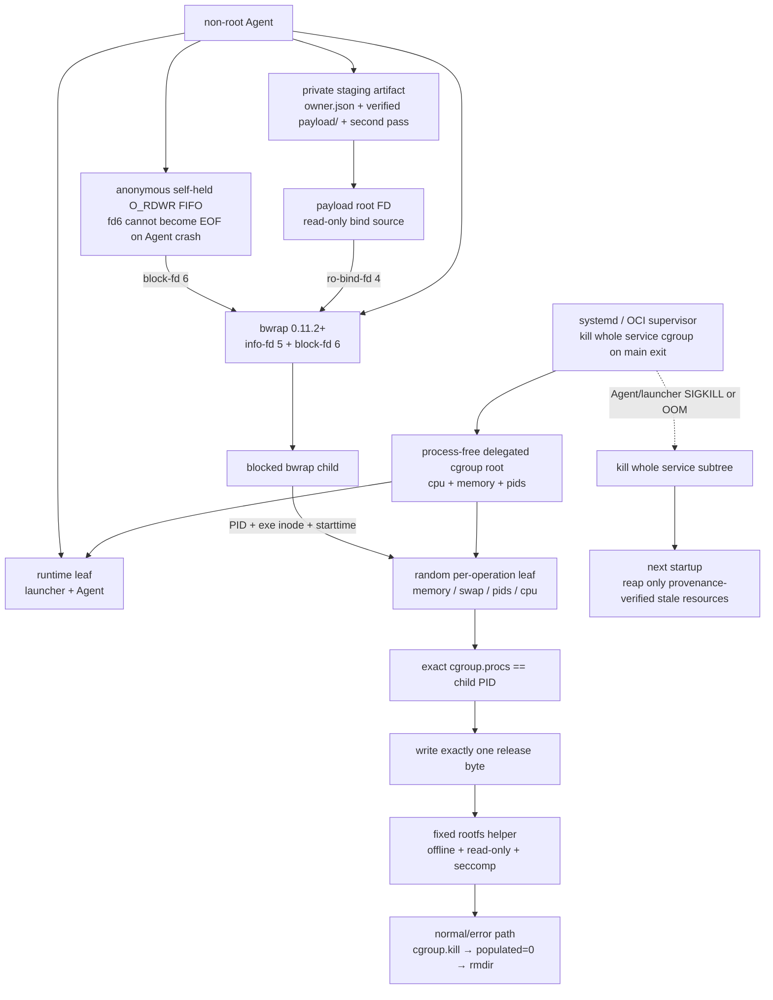

# Linux Sandbox 生产运行手册

本文描述 PR10B 的单机、单用户 production process lane。它不是“装好 bwrap 即可”的开发模式：cgroup、rootfs、seccomp、staging 或 FD 限额缺失时，`SandboxExecutor.probe()` 必须失败；launcher/supervisor 则由部署方声明，并通过独立 crash attestation 证明，probe 无法仅凭进程内信息确认外部 reaper 的真实行为。

## 运行拓扑



`SUPER_AGENT_SANDBOX_CGROUP_ROOT` 指向 service 的 process-free delegated root，不是 Agent 当前所在 leaf。仓库的 systemd launcher 把 Agent 放在该 root 下的 `super-agent-runtime/`，operation 是同一 root 下的 sibling；OCI 可以使用不同 runtime leaf 名称，但必须保持相同的 process-free delegation 拓扑。若 Agent 位于 delegation 外部，内核会拒绝跨边界写 `cgroup.procs`。

## Supervisor 契约

production 必须显式设置：

- systemd：`SUPER_AGENT_SANDBOX_CRASH_SUPERVISOR=systemd-control-group-v1`
- OCI 容器：`SUPER_AGENT_SANDBOX_CRASH_SUPERVISOR=container-control-group-v1`

该变量是部署声明，不替代验收；代码只验证它属于允许的枚举值。systemd 必须使用 `Delegate=cpu memory pids`、`KillMode=control-group` 和有限 `LimitNOFILE`；OCI 必须让 Agent 命令处于 container main 生命周期中，main 退出后由 runtime kill 整个容器 cgroup。普通后台 shell、tmux、nohup 或仅靠 Node `finally` 不符合 production 契约。发布前必须从 service/container 外注入 launcher/Agent `SIGKILL` 与 OOM，并确认 operation、blocked bwrap 和 target 都被外部 supervisor 回收。

仓库提供：

- `scripts/linux-sandbox-launcher.mjs`：验证 systemd delegation，要求 service root 只有 launcher，将自身移入 runtime leaf，再以 argv-only 方式启动 Agent。
- `deploy/super-agent.service.example`：最小 systemd 示例。生产安装时必须替换路径、session 与 prompt，并由配置管理系统部署。

服务 root 的父级 envelope 必须大于单 operation 限额；例如 operation memory 为 1 GiB 时，service `MemoryMax` 需要同时容纳 Agent、staging 和至少一个 operation。当前 `workspace_inspect` 在 host staging admission controller 完成前被强制串行。

## Rootfs 与 seccomp

要求 bwrap `>= 0.11.2`，并同时支持：`--disable-userns`、`--seccomp`、`--size`、`--unshare-cgroup`、`--ro-bind-fd`、`--info-fd`、`--block-fd`。

可信 rootfs 至少包含以下 root-owned、不可组/其他用户写的静态 helper：

```text
/usr/libexec/super-agent/seccomp-probe
/usr/libexec/super-agent/workspace-inspect
/usr/libexec/super-agent/sandbox-release-probe   # release gate only
```

构建与漂移检查：

```bash
make -C sandbox/seccomp helpers
node sandbox/seccomp/build-profile.mjs --check
pnpm test:seccomp-artifacts
```

根据目标 `uname -m` 选择 `policy-v1.aarch64.bpf` 或 `policy-v1.x86_64.bpf`，并把 manifest 中对应 SHA-256 配置为 `SUPER_AGENT_SANDBOX_SECCOMP_SHA256`。当前 manifest 状态仍是 `candidate-linux-release-gate-required`。BPF、helper、rootfs、builder image 和 bwrap 都要进入 release attestation；不能把运维手填 digest 当成发布证明。

## Staging 与资源

production 必须显式配置 `SUPER_AGENT_SANDBOX_STAGING_PARENT`，建议放在单独的本地文件系统或 project quota 中。最终父目录必须由当前 UID 拥有且 group/other 不可写；root-owned sticky 目录只允许作为祖先，不能直接作为最终 staging parent。每个 artifact 先以 `0700` 创建并锚定目录 FD，再以 `O_EXCL` 写入绑定 schema、owner UID 和 artifact inode identity 的 `owner.json`，真正交给 sandbox 的副本位于 `payload/`；Linux 上的目的遍历走 `/proc/self/fd/N`。

每次复制受文件数、entry 数、总字节、单文件字节和深度限制；复制完成后对源 FD 全树再次核对 entry set、inode/metadata、bytes 和 SHA-256。请求 deadline/AbortSignal 同时贯穿 rootfs、workspace preflight 与 staging 遍历，实际 deadline 取调用方 deadline 和 sandbox wall limit 的较小值。它仍是“检测普通并发变化的 verified user-space copy”，不是原子文件系统 snapshot，也不抵御任意同 UID 恶意宿主进程。

launcher 必须设置有限 hard `RLIMIT_NOFILE`；运行时默认允许的 ceiling 是 4096，仓库当前 `test:linux-release` 为了实际命中 FD 上限使用 256。每 operation cgroup 强制写入并回读：`memory.max`、`memory.swap.max`、`memory.oom.group=1`、`pids.max`、`cpu.max`、`cgroup.max.depth=0` 和 `cgroup.max.descendants=0`。

## 发布与诊断

准备好 architecture-matching rootfs、BPF、delegated root、private staging parent 和 supervisor 后，在 aarch64 与 x86_64 各自目标内核分别运行并保存 attestation：

```bash
pnpm test:linux-release
pnpm check
pnpm build
git diff --check
```

`test:linux-release` 在非 Linux、缺环境变量或发生 skip 时必须非零退出。它覆盖公开 `SandboxExecutor` startup probe、固定 argv、UTF-8 输入边界、空结果语义、staging、只读、输出、deadline、取消、PID、FD、CPU 与 cleanup；memory/swap 会配置并回读，但当前 gate 尚未保存真实 OOM 的 `memory.events` 证明。随后用真实 Provider Key 运行 `pnpm start -- run ... --yes`，要求模型调用 `workspace_inspect`，并用 `pnpm start -- ops list --session <id>` 确认 operation 为 `succeeded`。

真实 Key E2E 必须使用独立干净 workspace；Provider Key/EnvironmentFile 位于 workspace 外，只注入 Agent 进程。不得把 Key、完整 `.env` 或 session journal 放进 rootfs、staging 或测试输出。E2E 只证明 Provider → Policy/Ledger/Router → Sandbox → fixed helper 的装配链，不替代另一架构、OOM/swap 或 supervisor crash attestation；验证后清理临时 session 与 fixture。

常见 probe reason：

- `sandbox_crash_supervisor_unconfigured`：未声明允许的 supervisor 契约；即使不再出现该 reason，仍需独立外部 crash attestation。
- `sandbox_open_files_limit_unbounded`：`Max open files` hard limit 为 unlimited 或超过配置上限。
- `sandbox_cgroup_*`：delegation 非空、controller 未委派、父限额不足、stale populated scope 或回读不一致。
- `sandbox_mkfifo_unavailable_or_untrusted`：固定 `mkfifo` 不是可信 root-owned executable。
- `sandbox_seccomp_*`：制品缺失、digest 漂移或完整 syscall probe 失败。
- `sandbox_workspace_helper_probe_failed`：真实固定 helper 缺失、版本不符或无法读取 probe fixture。
- `workspace_snapshot_*`：source 漂移、敏感/特殊条目、资源超限、parent 不可信或 cleanup 失败。

三类 stale 资源采用不同证明条件：operation cgroup 仅在名称合法、identity 稳定、`cgroup.procs` 为空且 `populated 0` 时删除；workspace 只回收 exact mkdtemp suffix、当前 UID、`0700`、超过安全年龄，且为空的 creation remnant 或具备合法 owner marker 的 artifact，删除前还会按配置上限有界验证整棵 `payload/` 的 owner/type/link/mode/entry/bytes/depth；self-held FIFO 目录只接受 exact suffix、私有 mode、允许的目录 link count，以及单链接 `0600 gate` FIFO/空目录。probe workspace 只接受空目录或内容完全匹配的 `probe.txt`，并使用 `unlink + rmdir`，不再递归删除。populated、malformed 或 provenance 不明的资源不会仅凭名字被清理，启动会 fail closed 或保留给可信运维处置。
