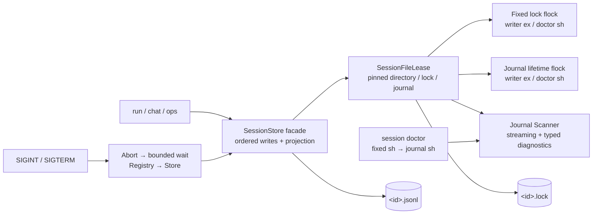

# Session Storage 运行手册

本文描述 M4 PR11A 的单文件 Session Storage。分段、rotation、quota、archive、restore
和 retention 属于 PR11B/PR11C，不能用本文的 PR11A 证据代替其验收。

## 当前拓扑



每个 session 使用同一私有目录下的两个文件：

- `<sessionId>.lock`：固定 inode 的进程生命周期协调锁。session 建立后不得删除、替换或
  通过 retention 重建。
- `<sessionId>.jsonl`：append-only v1/v2 event journal，同时承载第二把进程生命周期锁。
  只有同时持有 fixed lock 与 canonical journal exclusive flock 的当前版本 writer 可以打开、
  截断或追加。

加锁顺序固定为 fixed lock → journal，释放顺序为 journal → fixed lock，避免 writer/doctor
死锁。journal flock 使当前版本在 fixed lock inode 被异常替换后仍不会把正在写入的 canonical
journal 误判为空闲，但旧二进制不会自动获得第二把锁。PR11A 不支持新旧 writer 并行或滚动
升级；升级时必须先停止所有旧 writer，确认进程退出，运行 doctor，再启动新版本。PR11B 的
storage-format fence 才负责让旧 writer 必然拒绝分段布局。

目录和普通文件分别使用 `0700`、`0600`。writer 与 doctor 都拒绝 symlink、hardlink、
特殊文件、owner 不匹配和 inode/path identity 漂移。session 目录必须位于本机文件系统，
并由 Agent 的专用 OS 用户独占；NFS、共享可写目录以及任意同 UID 恶意进程不在当前保证内。

## 大小与恢复边界

| 边界 | 默认值 | 行为 |
| --- | ---: | --- |
| 新写 JSONL record | 1 MiB | 在写入和 sequence 消耗前拒绝 |
| 既有 record 兼容读取 | 16 MiB | 超限时 fail closed，必须离线迁移 |
| EOF 未完成 record | 单条读取上限内 | doctor 报 `recoverable`；exclusive writer 可截断 |
| 中间坏行或完整错误尾行 | 不适用 | `corrupt` / writer fail closed，不猜测修复 |

大小按最终 UTF-8 字节计算，并包含 JSONL 换行。scanner 以 chunk 和单条 record 为内存边界；
跨记录的 `eventId`、`materializationId` 与 Operation projection 索引仍按事件数量增长。

checkpoint 的 `throughSequence` 表示它覆盖到的最后一个 journal sequence，由 Store 生成；
checkpoint 不会重置 Operation reducer，也不能遮蔽未对账状态。

## 只读诊断

```bash
pnpm start -- session doctor --session <session-id>
```

doctor 不创建目录或 lock，不 chmod、不截断，也不修复。它先在已存在的 fixed lock inode
尝试 non-blocking shared flock，再对已固定的 canonical journal descriptor 获取 shared
flock；任一步竞争都返回 `busy` 且不扫描。报告和错误不得包含 record 正文。

| status | 含义 | 操作 |
| --- | --- | --- |
| `missing` | journal 不存在 | 核对 session ID；不要用空文件伪造恢复 |
| `busy` | active writer 持有 exclusive lock | 等 writer 正常退出后重试 |
| `healthy` | 元数据、格式和 payload 均有效 | 可正常 continue |
| `recoverable` | 仅存在 EOF 半行 | 先保留备份，再让正常 writer 在 exclusive lock 下恢复 |
| `corrupt` | 元数据、完整记录、顺序或 payload 不安全 | 停止写入并保留现场，禁止手工删行后继续 |

doctor 成功生成 JSON report 时，无论 status 是 missing/busy/healthy/recoverable/corrupt，
当前命令退出码均为 0；自动化必须解析 `status`，非零只表示参数、启动或运行时失败。诊断
异常时保存以下非敏感信息：命令退出状态、report 的 diagnostic code、session ID、文件
大小和 inode 元数据。不要把 journal 正文、Provider key 或完整模型输入复制到工单。

## 信号与关停

one-shot `run` 收到 `SIGINT` / `SIGTERM` 后取消 active turn，等待有限 grace，关闭 Registry，
再 flush/close Store 并释放双锁；干净取消分别退出 130/143，close 或 flush 失败退出 1。

交互 `chat` 在 active turn 上第一次 `SIGINT` 只取消当前 turn 并继续 REPL；空闲时第一次
`SIGINT` 或任意时刻 `SIGTERM` 才进入完整关停。关停尚未结束时第二次 `SIGINT` 直接以 130
强制退出。

若 Provider 或工具忽略取消，active wait 与资源 close 都有上限。grace 超时属于异常退出：
进程返回非零，并依赖 systemd/OCI supervisor 在外层 stop timeout 到达时执行最终回收；该路径
不承诺最后的 buffered event 已 flush。第二次 `SIGINT` 直接以 130 强制退出，同样依赖下次
启动的 recovery/doctor 收束。

production systemd unit 的 `TimeoutStopSec` 必须大于 Agent 内部关停总上限，并保留
`KillMode=control-group` 与 `SendSIGKILL=yes`。示例见 `deploy/super-agent.service.example`。

## 故障处理

1. 停止自动重启，确认没有 active writer；不要删除 `.lock`。
2. 运行 `session doctor` 并记录结构化诊断码。
3. `busy` 时定位并正常停止持锁进程；禁止复制 lock 或创建第二个同名 session bundle。
4. `recoverable` 时先备份两个文件，再通过正常 `SessionStore.open()` 恢复；复跑 doctor。
5. `corrupt` 时保留原文件，只在隔离副本上分析。PR11A 没有在线 repair 命令。
6. 对 `uncertain` Operation 先用 `ops list/resolve` 对账，不得仅靠修改 checkpoint 绕过。

## 发布门禁

PR11A 发布前必须同时通过：typecheck、全量测试、build、deterministic seccomp artifact check、
11 点 Operation `SIGKILL` crash matrix、真实 SIGTERM 子进程测试、doctor 的 missing/busy/
healthy/recoverable/corrupt 矩阵，以及真实 Provider 的 create → clean close → doctor → continue
装配验证。

2026-07-16 非 CI 证据：`pnpm check` 为 344 tests、334 pass、10 个平台 skip、0 fail，
PR11A 定向矩阵 92/92，build、diff check 和 deterministic seccomp artifact 2/2 通过。真实
Key 的 `pnpm start` create/continue 均返回固定标记，两次 doctor 分别扫描 6/11 条记录且均为
`healthy`；值级扫描检查 2 个 `.env` secret value，journal 命中为 0，命令输出未显示 Key。

真实 key E2E 只证明 Provider、Ledger、Store 和 reopen 已正确装配；它不能证明 fsync、主机
掉电耐久、rotation 或 quota。验证脚本只能输出 pass/fail，必须额外确认 key 未进入 journal、
diagnostic 或终端日志。
