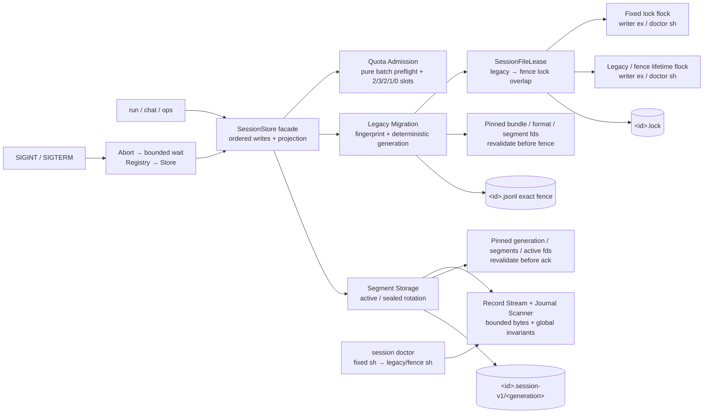

# Session Storage 运行手册

本文描述 M4 PR11B 的 layout-v1 Session Storage：legacy 迁移、exact fence、active/sealed
rotation、regular quota、critical reserve 与跨 segment doctor。archive、restore、retention 和
目录总额度仍属于 PR11C；不要用本手册推断这些能力已经存在。

## 当前拓扑



一个已迁移 session 的布局为：

```text
.sessions/
├── <sessionId>.lock
├── <sessionId>.jsonl
└── <sessionId>.session-v1/
    └── <generation>/
        ├── format.json
        ├── manifest.json
        └── segments/
            ├── 000000000001.sealed.jsonl
            └── 000000000002.active.jsonl
```

- `<sessionId>.lock`：固定 inode 的进程生命周期协调锁。session 建立后不得删除、替换或
  通过 retention 重建。
- `<sessionId>.jsonl`：迁移前是唯一 legacy 真相；迁移后只能是
  `SUPER_AGENT_SESSION_STORAGE_FENCE_V1 <64-lowercase-hex>\n`，并持有第二把 writer
  生命周期 flock。fence 是唯一迁移 commit point，旧单文件 writer 会把它当无效 JSON 而拒写。
- `format.json`：immutable canonical contract，冻结 source fingerprint、record/segment/quota
  limits；显式 reopen 配置冲突时 fail closed。
- `segments/`：ordinal 从 1 开始且固定 12 位；仅允许若干 sealed 与唯一最大 ordinal active。
  manifest 只是这些文件的可重建缓存，不保存 sequence、Operation projection 或 quota 权威状态。

迁移锁顺序固定为 fixed exclusive → legacy exclusive。typed Operation/quota gate 在 staging
完成，拒绝时精确删除本次 staging，不得先发布同 generation 的冲突 contract。bundle 完整同步
并复验后，writer pin bundle root、generation、segments、format 与全部 segment descriptor，创建并
预锁 fence temp，rename 覆盖 legacy，复验 fence path/fd/bytes 并 fsync parent directory，才
释放 legacy lock；fence lock 保持到 Store close。fence 前只采用当前 legacy fingerprint；fence
后只采用其指向 generation，禁止回退或合并其他 orphan bundle。发布新版本前仍应先停止全部
旧 writer；fence 防止其误写，不构成混合版本滚动升级支持。

目录和普通文件分别使用 `0700`、`0600`。writer 与 doctor 都拒绝 symlink、hardlink、
特殊文件、owner 不匹配和 inode/path identity 漂移。session 目录必须位于本机文件系统，
并由 Agent 的专用 OS 用户独占；NFS、共享可写目录以及任意同 UID 恶意进程不在当前保证内。

## 大小与恢复边界

| 边界 | 默认值 | 行为 |
| --- | ---: | --- |
| 新写 JSONL record | 1 MiB | 在写入和 sequence 消耗前拒绝 |
| 既有 record 兼容读取 | 16 MiB | 超限时 fail closed，必须离线迁移 |
| active EOF fragment | 单条读取上限内 | doctor 只报；exclusive writer 可截断并同步 |
| sealed EOF fragment | 不适用 | fatal；不得截断或猜测合并 |
| segment target | 16 MiB | soft target；单条完整 record 可独占并超过 target |
| regular quota | 64 MiB | 普通 event bytes 上限，不得消耗 reserve |
| critical reserve | 16 MiB | Operation 恢复义务与 critical events |
| 中间坏行或完整错误尾行 | 不适用 | `corrupt` / writer fail closed，不猜测修复 |

大小按最终 UTF-8 字节计算，并包含 JSONL 换行。scanner 以 chunk 和单条 record 为内存边界；
跨记录的 `eventId`、`materializationId` 与 Operation projection 索引仍按事件数量增长。

rotation 在 Store 单写队列内按 `fdatasync active → rename sealed → fsync segments dir →
O_EXCL create next active → sync file/dir → rebuild manifest` 执行。quota admission 在任何
rotation、write 或 sequence 接受前完成；schema marker 与业务 event 作为一个 batch 预检。
generation/segments directory 与 active descriptor 从 writer open pin 到 close，durable ack 前
再次验证 path identity。manifest publish 是 cache 操作：普通失败告警但不否定已同步 event，
unsafe metadata 仍 fatal；失败的 exact temp 必须清理。lazy recovery 失败先关闭局部 descriptor，
不能让重试覆盖并泄漏上一套 storage。

reservation 只由完整事件流与 Operation projection 恢复：proposed/approved 为 2 slots，started
为 3，uncertain 为 2，terminal 尚未 materialize 为 1，materialized 为 0。每个 slot 等于
`maxRecordBytes`。started 无法取得第 3 个 slot 时不得 durable ack，dispatch 次数必须为 0。
checkpoint 不会重置 Operation reducer，也不能遮蔽未对账状态。

## 只读诊断

```bash
pnpm start -- session doctor --session <session-id>
```

doctor 不创建目录或 lock，不 chmod、不截断、不重建 manifest，也不修复。它先在已存在的
fixed lock inode 尝试 non-blocking shared flock，再对已固定的 legacy/fence descriptor 获取
shared flock；任一步竞争都返回 `busy` 且不扫描。exact fence 后只读取指定 generation，直接
扫描 segment 文件事实；missing/corrupt/stale manifest 仅告警。doctor 同时验证跨段 Operation
projection 与 quota obligations；在线/离线 scan error 都应定位到实际 segment 与 segment-local
offset，不能误指向 fence。manifest 重建失败必须报告 `repaired: false`。报告和错误不得包含
record 正文。

| status | 含义 | 操作 |
| --- | --- | --- |
| `missing` | legacy/fence 不存在 | 核对 session ID；不要用空文件伪造恢复 |
| `busy` | active writer 持有 exclusive lock | 等 writer 正常退出后重试 |
| `healthy` | 元数据、格式和 payload 均有效 | 可正常 continue |
| `recoverable` | active EOF fragment、缺 active 或 manifest cache 问题 | 先保留备份，再让正常 writer 恢复并复跑 doctor |
| `corrupt` | 元数据、完整记录、顺序或 payload 不安全 | 停止写入并保留现场，禁止手工删行后继续 |

doctor 成功生成 JSON report 时，无论 status 是 missing/busy/healthy/recoverable/corrupt，
当前命令退出码均为 0；自动化必须解析 `status`，非零只表示参数、启动或运行时失败。诊断
异常时保存以下非敏感信息：命令退出状态、report 的 diagnostic code、session ID、文件
大小和 inode 元数据。不要把 journal 正文、Provider key 或完整模型输入复制到工单。

## 信号与关停

one-shot `run` 收到 `SIGINT` / `SIGTERM` 后取消 active turn，等待有限 grace，关闭 Registry，
再 flush/close Store 并释放双锁；干净取消分别退出 130/143，close 或 flush 失败退出 1。

交互 `chat` 在 active turn 上第一次 `SIGINT` 只取消当前 turn 并继续 REPL；空闲时第一次
`SIGINT` 或任意时刻 `SIGTERM` 才进入完整关停。关停尚未结束时第二次 `SIGINT` 直接以 130
强制退出。

若 Provider 或工具忽略取消，active wait 与资源 close 都有上限。grace 超时属于异常退出：
进程返回非零，并依赖 systemd/OCI supervisor 在外层 stop timeout 到达时执行最终回收；该路径
不承诺最后的 buffered event 已 flush。第二次 `SIGINT` 直接以 130 强制退出，同样依赖下次
启动的 recovery/doctor 收束。

production systemd unit 的 `TimeoutStopSec` 必须大于 Agent 内部关停总上限，并保留
`KillMode=control-group` 与 `SendSIGKILL=yes`。示例见 `deploy/super-agent.service.example`。

## 故障处理

1. 停止自动重启，确认没有 active writer；不要删除 `.lock`。
2. 运行 `session doctor` 并记录结构化诊断码。
3. `busy` 时定位并正常停止持锁进程；禁止复制 lock 或创建第二个同名 session bundle。
4. `recoverable` 时先备份 fence、format、manifest 与全部 segments，再通过正常
   `SessionStore.open()` 恢复；复跑 doctor。不要手工把 sealed 改回 active。
5. `corrupt` 时保留整个 generation，只在隔离副本上分析。不要改 fence 指向其他 orphan，
   不要把 manifest 内容当作事件恢复依据。
6. 对 `uncertain` Operation 先用 `ops list/resolve` 对账，不得仅靠修改 checkpoint 绕过。
7. quota 拒绝时先停止普通写入并收束已有 Operation；不要删除 terminal/materialization 事实，
   也不要直接编辑 immutable `format.json`。需要扩大 contract 时使用后续显式离线迁移能力。

## 发布门禁

PR11B 发布前必须同时通过：typecheck、全量测试、build、deterministic seccomp artifact check、
11 点 Operation `SIGKILL` matrix（极小 segment target）、全部 migration/rotation fault points 的
真实子进程 `SIGKILL` 恢复、真实 SIGTERM、跨 segment doctor、quota dispatch=0 与 legacy fence
兼容矩阵。测试 I/O wrapper 必须透传真实 `fd/stat/read` 和 flock 边界。

还必须使用 `pnpm start` 与真实 Provider 完成 create → clean close → doctor → continue → doctor，
以极小 segment target 确认跨 segment 恢复。验证程序只能输出 pass/fail，并按 `.env` 的 secret
value 做值级扫描，确认 Key 不在终端输出、fence、segment、format、manifest 或 diagnostic。
该 E2E 只证明真实装配，不证明 quota 数学或 crash consistency。

当前目录 fsync、rename fault injection 与真实 `SIGKILL` 只支持“进程崩溃后可恢复”的结论；
它们不是主机掉电或存储控制器耐久证明。target-Linux delegated systemd/OCI supervisor、真实
power-loss、x86_64 target-kernel 与 OOM gate 仍需在发布环境单独执行。

2026-07-17 本地非 CI 证据：PR11B 定向 185/185；全量 447 tests（437 pass、10 platform
skip、0 fail）；build、diff check 与 deterministic seccomp artifact 2/2 通过；真实
migration/rotation `SIGKILL` 12+5 点。真实 Provider Key 的 512-byte
target E2E 产生 10 个 segment，create/continue 标记均返回，doctor 6→11 records 均 healthy；
2 个 `.env` secret value 在输出、diagnostic、fence、segments、format、manifest 中 0 命中，
临时 session 已清理。
