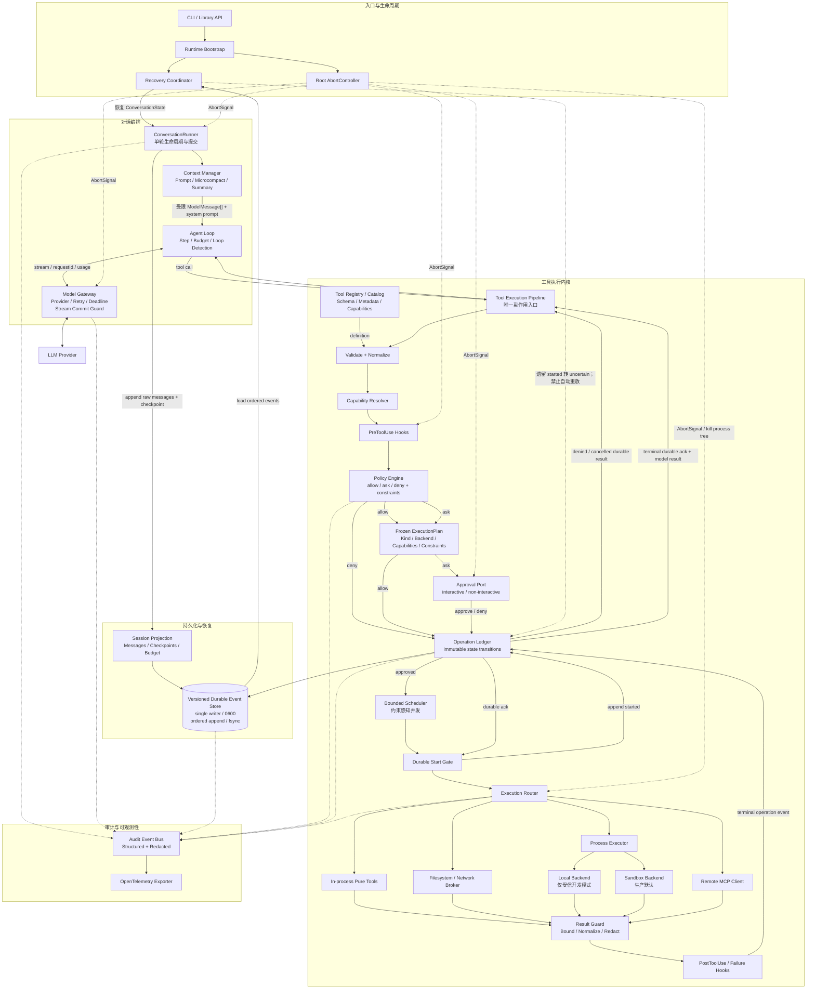
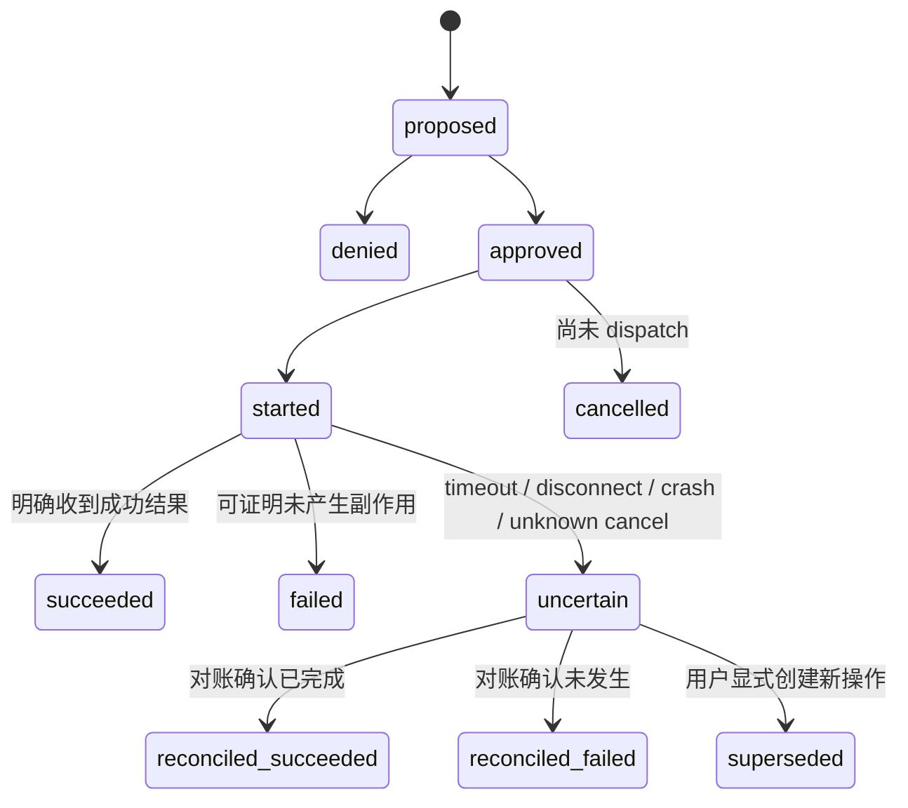
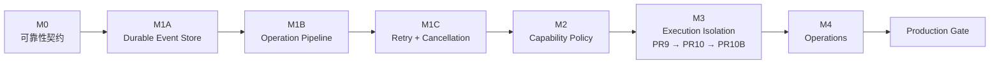
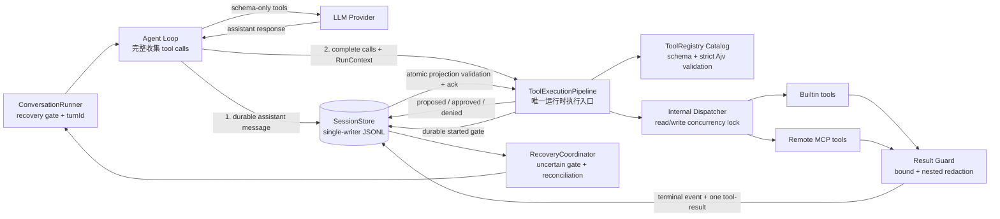
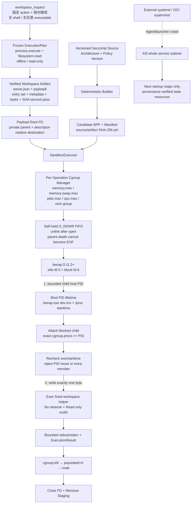
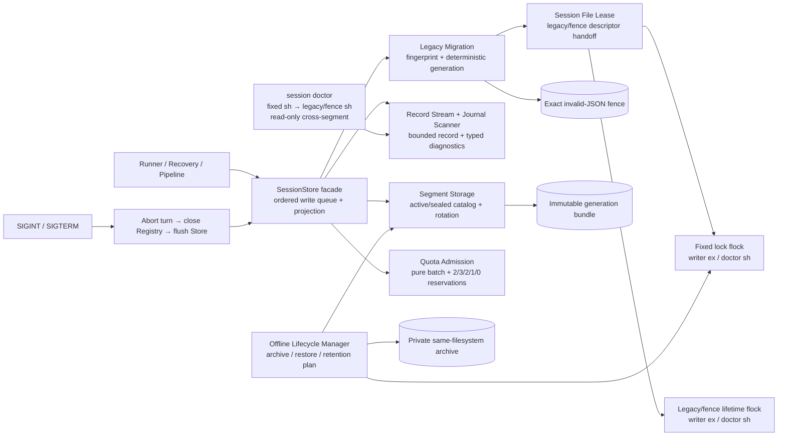

# Super-Agent 生产化规格说明

> 状态：Draft
>
> 目标版本：2.0
>
> 最后更新：2026-07-16
>
> 实施状态：M0、M1A、M1B、M1C、M2、M3 PR9 已完成；M3 PR10B 代码实现完成，arm64 Linux release matrix 与真实 Key production E2E 已通过；x86_64 目标内核、OOM/swap 事件证据和真实 systemd crash attestation 待完成

## 1. 背景与结论

Super-Agent 当前已经具备多步 Agent Loop、能力策略、耐久操作账本、并发控制、统一取消、上下文压缩、会话恢复、MCP 延迟发现和 fail-closed 执行约束。首个 production process lane 已实现并在 arm64 Linux 完成真实 Provider 装配验证，因此它明显超过一次性 Demo；但跨架构/外部 supervisor 发布认证与 M4 运维闭环完成前，仍不宣称达到 production-ready。

下一阶段不继续横向增加工具、多 Agent 编排或 UI 功能，而是把现有骨架收敛为一个小型、完整、可验证的生产 Agent 内核：

- 工具调用在崩溃、取消和重试后不会被静默重复执行。
- 每个工具调用都有明确的能力、权限和隔离边界。
- 原始事件、恢复状态和模型上下文相互分离，既可审计又可压缩。
- 所有外部行为可取消、可追踪、可限制、可恢复。
- 默认配置遵循 fail-closed；显式危险模式仍需保留清晰提示和审计记录。

本规格将“生产级”限定为：**单机、单用户、单会话写者场景下的可靠生产内核**。多租户控制面、分布式调度、高可用集群和远程工作节点不在 2.0 范围内。

## 2. 设计原则

1. **麻雀虽小，五脏俱全**：每个生产边界都提供最小但闭环的实现，不提前构建平台化抽象。
2. **副作用先记账**：任何可能改变外部状态的操作，执行前必须存在持久化记录。
3. **能力不等于工具名称**：权限根据工具能力、参数和运行约束判断，不能仅依赖 `isReadOnly`。
4. **默认拒绝**：无法解析、无法验证或状态不确定时，不自动放行或重试。
5. **原始事实不可由摘要替代**：摘要只服务模型上下文，不作为审计和恢复的唯一依据。
6. **取消必须传到底层**：从 CLI、模型请求、审批到工具进程使用同一条取消链路。
7. **渐进演进，不整体重写**：保留现有 Runner、Agent Loop、ToolRegistry、SessionStore 和 Compressor 的职责边界，在边界内替换实现。

## 3. 非目标

2.0 不包含：

- 多租户认证、组织权限和计费平台。
- 跨机器分布式事务或全局 exactly-once 保证。
- Kubernetes 调度器、远程 Agent Fleet 或高可用控制面。
- 完整复刻 Claude Code、OpenClaw 或 Manus 的产品功能。
- 默认启用自主长期运行、多 Agent 群体协作或后台无人值守写操作。

对于无法由下游系统提供幂等语义的外部副作用，系统目标是“**不静默重复、明确标记不确定状态并要求对账**”，而不是宣称通用 exactly-once。

## 4. 当前基线与主要差距

### 4.1 已有能力

- 多 step Agent Loop 和最大步数限制。
- 模型请求重试、累计 token 预算和循环检测。
- 工具 schema 校验、审批回调、读写锁和结果截断。
- 工作区路径、symlink、Web 私网访问和响应大小检查。
- 冻结 ExecutionPlan、Filesystem/Network Broker、Linux read-only/offline Sandbox、固定 `workspace_inspect`、verified staging、per-operation cgroup、crash-safe release handshake 与正则 worker 硬超时。
- append-only JSONL 原始消息与 checkpoint 恢复。
- Microcompact 与 LLM Summary 双层上下文压缩。
- MCP 工具延迟发现。

### 4.2 剩余 P0 差距

- PR10B 已在 arm64 Linux 通过 non-skippable public `SandboxExecutor` matrix、Linux FD/PID/FIFO/staging 专项与真实 Key `workspace_inspect` E2E；但仓库同时发布 x86_64 candidate，尚无对应目标内核 attestation。
- `SUPER_AGENT_SANDBOX_CRASH_SUPERVISOR` 目前只是部署声明。必须在真实 systemd delegated unit 或等价 OCI main 生命周期中从外部注入 launcher/Agent `SIGKILL` 与 OOM，证明整个 service/container subtree 被回收；进程内 probe 不能替代该证据。
- per-operation memory/swap 限制会写入并回读，默认和 release matrix 均为 swap 0；当前公开 matrix 尚未保存真实 OOM 的 `memory.events`/swap 证据。

### 4.3 P1 差距

- 会话 journal 尚缺轮转、配额、归档和长期保留策略。
- 缺少统一可插拔审计出口、结构化指标与长期运维告警。
- verified user-space staging 能检测普通并发漂移并提供独立副本，但不是原子文件系统 snapshot，也不抵御任意同 UID 恶意宿主进程；staging 仍需 service envelope、串行 admission 与宿主配额。

## 5. 目标架构



模块边界：

| 模块 | 唯一职责 | 不负责 |
| --- | --- | --- |
| `ConversationRunner` | 单轮串行、上下文阶段、消息与 checkpoint 提交 | 权限判断、工具执行 |
| `AgentLoop` | step、预算、循环检测、模型与工具结果编排 | 直接调用工具实现 |
| `ModelGateway` | Provider、稳定 requestId、deadline、取消和流式重试门槛 | 工具审批和副作用恢复 |
| `ToolRegistry` | 公开只读工具目录、schema、能力元数据和 resolved snapshot | 审批和公开 dispatch |
| `ToolExecutionPipeline` | 工具调用的唯一公开运行时入口、固定治理顺序与包内 dispatch | Provider 会话管理 |
| `PolicyEngine` | 返回纯 `allow/ask/deny + constraints` 决策 | UI 交互和执行工具 |
| `OperationLedger` | 校验操作状态迁移和 durable-start | 保存自然语言摘要 |
| `ExecutionRouter` | 执行已经批准的约束，分流 pure/broker/process/MCP | 扩大权限 |
| `RecoveryCoordinator` | 持锁恢复、回放事件、处理遗留操作和结果物化 | 自动重放不确定操作 |
| `AuditEventBus` | 接收已经提交的结构化、脱敏事实 | 充当可靠性账本 |

`OperationLedger` 与 Session Projection 逻辑分离；2.0 为控制规模，可以共用同一个有序 JSONL Event Store。不得为两者分别写文件后再假设跨文件提交具有原子性。

统一工具调用顺序：

```text
validate
→ evaluate policy
→ preflight supported/tightened execution constraints for non-deny decisions
→ persist proposed
→ deny, allow, or request human approval
→ persist approved for allow or an approved ask
→ defensively revalidate execution constraints
→ persist started durably
→ dispatch through package-internal dispatcher
→ persist succeeded/failed/cancelled/uncertain
→ append tool result message
```

工具实现不得绕过该流水线直接产生外部副作用。模型生成和工具执行必须拆为两个显式阶段：模型先产出完整 tool call 并持久化，再由 Agent Loop 调用 Pipeline；AI SDK 的工具回调不得在流式生成阶段自动执行工具。

## 6. 功能规格

### 6.1 Operation Ledger

新增逻辑独立的操作账本，使用不可变事件记录工具副作用生命周期。最小数据结构：

```ts
type OperationStatus =
  | 'proposed'
  | 'approved'
  | 'started'
  | 'succeeded'
  | 'failed'
  | 'denied'
  | 'cancelled'
  | 'uncertain'
  | 'reconciled_succeeded'
  | 'reconciled_failed'
  | 'superseded'

interface OperationEvent {
  schemaVersion: 2
  eventId: string
  sequence: number
  operationId: string
  sessionId: string
  turnId: string
  stepId: string
  requestId: string
  toolCallId: string
  toolName: string
  capabilitySet: string[]
  inputDigest: string
  redactedInput?: unknown
  status: OperationStatus
  idempotencyKey?: string
  attemptId?: string
  timestamp: string
  resultDigest?: string
  modelResult?: unknown
  resultRef?: string
  errorCode?: string
}

interface IdempotencyContract {
  scope: 'operation'
  ttlMs?: number
  retrySafeAfterUnknownOutcome: boolean
  reconcile?: (key: string) => Promise<ReconcileResult>
}
```



要求：

- `operationId` 在一次逻辑工具调用中保持稳定；每次 dispatch 使用独立 `attemptId`，所有 attempt 共用同一个幂等键。
- `inputDigest` 对移除敏感字段后的规范化输入计算，或使用至少 32 bytes 的本机密钥 HMAC；不能记录明文 secret，也不能让低熵 secret 可被普通摘要字典枚举。
- 构造 API 不接受裸 `inputDigest/redactedInput/modelResult`；只能接收由受控 protection port 生成的 branded 输入/结果。可读参数和结果默认不落盘，显式开启时仍受脱敏、深度和 64 KiB 上限约束。
- journal 回放数据在进入 reducer 前执行完整运行时 schema 校验；未知字段、非法 enum、弱 digest、错误 proof、错位 attempt/result 字段一律 fail-closed。
- 执行外部副作用前，`started` 事件必须完成耐久写入。
- `started` 耐久写入后、真正 dispatch 前仍存在崩溃窗口。恢复时允许产生“假 uncertain”，这是“宁可要求对账，也不静默重放”的预期取舍。
- `failed` 只表示可以证明没有产生副作用，或下游明确事务性拒绝；dispatch 后的超时、断连、强杀和取消结果未知必须写为 `uncertain`。
- `cancelled` 只适用于尚未 dispatch，或执行器能够证明操作没有开始的情况。
- 进程恢复时，遗留的 `started` 操作转换为 `uncertain`。
- `uncertain` 操作禁止自动重放。只读且可证明无副作用的操作可由策略显式允许重新执行。
- 只有下游幂等契约经过测试、仍在 TTL 内且声明 `retrySafeAfterUnknownOutcome` 时，才允许在未知结果后自动重试。
- 优先使用只读 `reconcile` 对账，不得用再次调用写操作代替对账。
- `succeeded` 事件保存经过截断和脱敏的 `modelResult` 或耐久 `resultRef`。恢复时若 terminal event 已存在但 tool-result 消息缺失，使用确定性 `eventId` 补建一次。
- 敏感结果不能持久化时，恢复过程补建“操作已成功，但结果不可恢复，禁止重跑”的合成工具结果。
- 用户对 `uncertain` 操作完成对账后，系统追加 `reconciled_succeeded`、`reconciled_failed` 或 `superseded` 事件，不能覆盖旧记录。

### 6.2 能力与权限模型

工具必须声明能力，而不是只声明“只读/读写”：

```ts
type ToolCapability =
  | 'filesystem.read'
  | 'filesystem.write'
  | 'process.execute'
  | 'network.egress'
  | 'secret.read'
  | 'external.read'
  | 'external.write'
  | 'user.interaction'
```

工具保留单独的 `isConcurrencySafe(input)`；并发安全和权限安全不得再共用同一字段。

策略引擎输入至少包含：

- 工具名称、规范化参数和能力集合。
- 当前权限模式、会话来源和是否为非交互运行。
- 工作区、目标路径、目标域名和 MCP Server 身份。
- 是否进入沙箱、沙箱文件系统和网络约束。
- 用户级、项目级、CLI 临时规则和 Hook 决策。

策略结果：

```ts
type PolicyDecision =
  | { behavior: 'allow'; constraints: ExecutionConstraints; reasonCode: string }
  | { behavior: 'ask'; constraints: ExecutionConstraints; reasonCode: string }
  | { behavior: 'deny'; reasonCode: string }
```

决策优先级：

1. 输入不合法或无法解析：deny。
2. 显式 deny 和不可绕过的安全规则：deny。
3. 敏感路径、外部写入和沙箱逃逸请求：ask 或 deny。
4. Hook 可以收紧权限；默认不得覆盖不可绕过的安全规则。
5. 显式 allow 规则仅在其约束范围内生效。
6. 未匹配规则：根据能力风险 ask 或 deny。

最低安全规则：

- `.env`、SSH、云凭据、系统 keychain、包管理器 token 等路径归类为 `secret.read`。
- 同时具备 `secret.read` 与 `network.egress` 的执行计划默认拒绝。
- MCP 工具在缺少可信能力元数据时按 `network.egress + external.write`、串行、需审批处理，并以 endpoint 的 scheme/host/port 和结构化 server identity 约束调用。
- `--yes` 只能跳过人工确认，不能跳过 deny、安全规则、账本和沙箱约束。

### 6.3 Tool Execution Pipeline

所有内置和 MCP 工具通过统一流水线执行：

1. 使用 schema 严格解析输入，拒绝未知字段。
2. 计算能力和动态约束。
3. 执行 PreToolUse Hook。
4. 获取策略结果和人工审批。
5. 写入 Operation Ledger。
6. 交给 Execution Router 执行。
7. 截断和脱敏结果。
8. 执行 PostToolUse 或 PostToolFailure Hook。
9. 写入结果事件和会话消息。

Hook 必须具备超时和取消信号。Hook 异常默认不能扩大权限。

只有 `isConcurrencySafe(input) === true` 且策略约束互不冲突的操作可以并发。带有 `filesystem.write`、`external.write` 或未知能力的工具默认串行。

### 6.4 执行路由与沙箱

定义统一路由接口：

```ts
interface ExecutionRouter {
  dispatch(request: ExecutionRequest, control: ExecutionControl): Promise<ExecutionResult>
}

interface ExecutionControl {
  signal: AbortSignal
}
```

路由必须根据可序列化的 `ExecutionRequest` 选择明确的执行边界：

- In-process pure tool：只允许不访问文件、网络、环境变量和外部状态的纯逻辑。
- Filesystem/Network Broker：由宿主受控代理实施路径、域名、连接和大小限制。
- Process Executor：开发和显式受信模式可使用 Local Backend；生产默认 Sandbox Backend。
- Remote MCP：远端副作用不受本地沙箱约束，依靠可信身份、能力、审批、幂等和结果限制治理。

Sandbox Backend 最低要求：

- 默认禁止网络，仅开放策略批准的域名和端口。
- 仅挂载显式 workspace；workspace 外不可见或只读。
- 不继承宿主机完整环境变量，只注入 allowlist。
- 独立临时目录，退出后清理。
- 限制 CPU、内存、磁盘、进程数、打开文件数和墙钟时间。
- 禁止访问 Docker socket、SSH agent、云元数据地址和宿主机服务 socket。
- 超时或取消时终止完整进程树。
- 记录退出码、终止原因、资源使用和沙箱违规事件。

如果当前平台不支持沙箱，生产模式启动失败；不得静默降级到 Local Backend。

### 6.5 模型流与重试

- 每个模型请求具有稳定的 `requestId` 和 attempt 计数。
- 仅在尚未向用户、会话或工具流水线提交任何可观察输出时允许整体重试。
- 一旦产生文本增量、完整 tool call 或其他已提交事件，失败必须结束当前 attempt，不得从头静默重放。
- Provider 支持幂等请求键时必须传递 `requestId`。
- 重试退避支持服务端 `Retry-After`，并受 absolute deadline 与 `maxRetries` 限制。失败 attempt 的费用预留与累计成本门禁由 PR13 实现；M1C 不宣称具备该能力。
- 模型、审批、Hook、工具和持久化等待均接受同一根 `AbortSignal` 派生的子信号。

### 6.6 会话存储与恢复

会话继续使用 append-only JSONL，但区分三类事实：

- `message`：原始用户、模型和工具消息。
- `operation`：工具副作用状态机事件。
- `checkpoint`：用于快速恢复的派生工作状态。

要求：

- 所有 v2 事件包含 `schemaVersion`、唯一 `eventId` 和单调 `sequence`；无版本事件按 v1 兼容读取。
- 会话目录权限为 `0700`，会话文件为 `0600`。
- 同一 session 对固定 lock inode 使用内核 advisory exclusive lock；第二个写者必须失败并给出可诊断错误，进程崩溃后由内核释放。锁文件不删除、不依赖 PID 或 stale 回收。
- writer lock 仅承诺本机文件系统，不承诺 NFS 等远程文件系统；原生锁依赖要求部署镜像具备对应 native addon 构建或预构建能力。
- 单个逻辑事件必须以一条完整 JSONL 记录追加。
- 读取时允许忽略或截断 EOF 尾部半行；中间损坏、完整错误尾行、sequence 缺口和重复 `eventId` 必须报告并停止自动恢复。
- 明确定义 flush 策略：普通消息可以批量 flush；`operation.started` 必须进入耐久写入边界。
- checkpoint 只用于加速恢复，并记录 `throughSequence`；不得重置或遮蔽 Operation reducer。删除 checkpoint 后仍能由原始事件重建有效状态。
- v2 reader 继续读取 v1；首次写 v2 必须先持锁并追加升级标记，不原地重写旧日志。旧程序识别到未知 v2 事件后必须拒绝继续写入。
- 配置单 session 大小、总目录大小、保留周期和归档策略。
- 原始事件不可被 LLM Summary 覆盖或删除，除非执行显式归档/清理策略。

### 6.7 上下文管理

保留当前两层压缩，不在 2.0 引入更多压缩子系统：

1. Microcompact 清除可重建且较旧的读取/搜索结果。
2. LLM Summary 汇总旧轮次，保留最近完整消息。

增强要求：

- 压缩前预留模型输出和压缩调用所需 token 空间。
- 连续压缩失败达到阈值后熔断，避免每一步重复产生失败请求和费用。
- 摘要使用结构化模板，至少包含目标、约束、已完成事项、未完成事项、关键文件和待确认风险。
- 工具操作状态、审批记录和 `uncertain` 状态不得只存在于自然语言摘要中。
- 压缩后重新注入仍有效的权限约束、任务状态和必要工具元数据，并设置严格 token 上限。

### 6.8 Web 与文件安全

- `read_file` 在解析真实路径后执行敏感路径分类。
- 写文件使用安全打开标志或临时文件加原子 rename，避免检查与写入之间的 symlink TOCTOU。
- Web 请求把 DNS 解析结果绑定到实际连接，重定向后的每一跳重新执行完整策略。
- 禁止私网、loopback、link-local、云元数据地址和不允许的端口。
- 限制响应头、正文、解压后大小、重定向次数和总耗时。
- 用户提供的正则在 worker 或 RE2 类引擎中执行，并有硬超时。

### 6.9 预算、限制与背压

- 在发起模型请求和工具执行前预留预算，结束后结算实际使用量。
- 同时支持 session token、费用、turn、step、工具调用数和墙钟时间上限。
- 并发工具具有全局和单工具上限。
- 流式事件、会话写入和工具输出必须有有界缓冲；消费者变慢时产生背压，不能无限增长内存。
- 达到硬限制时写入明确的终止事件，并保证已开始操作进入可恢复状态。

各通道过载策略：

| 通道 | 是否可丢 | 队列满时行为 |
| --- | ---: | --- |
| Operation / Event Store | 否 | 停止接收新工作；写失败则禁止 dispatch |
| tool result / message | 否 | 阻塞上游，并受 deadline 和取消信号控制 |
| UI text delta | 可合并 | 合并相邻 delta，保留最终文本 |
| telemetry | 可采样 | 丢弃低优先级事件并累计 dropped counter |
| audit / security event | 否 | fail closed |

并发限制同时约束正在执行数量和等待队列长度；锁等待、审批等待和调度队列都必须支持取消。Shell、HTTP、MCP 分别在数据源头限制原始字节，不能先把无限结果完整读入内存后再截断。

### 6.10 可观测性与审计

最小事件集合：

- `agent.turn.started/completed/failed`
- `model.request.started/retried/completed/failed`
- `permission.decided`
- `tool.operation.proposed/started/completed/uncertain`
- `context.compaction.started/completed/failed`
- `session.recovered/corrupted/locked`
- `sandbox.violation`

每个事件携带 `sessionId`、`turnId`、`stepId`、`requestId` 或 `operationId` 中适用的关联字段。

默认不记录：

- API key、token、cookie 和完整环境变量。
- 未脱敏的文件内容、Shell 命令输出和 MCP 参数。
- 用户输入和模型输出全文。

OpenTelemetry 作为可插拔出口；未配置 exporter 时，本地运行不依赖外部观测服务。

## 7. 分阶段实施

实施按 M0–M4 顺序推进。每个任务必须形成独立、可回滚、可验证的变更，不采用一次性大重写。



### 7.1 Subagent 实施模式

开发过程使用一个主 Agent 加最多三个并行 subagent。这里的 subagent 是开发协作方式，不代表 2.0 产品运行时要引入多 Agent 功能。

| 角色 | 职责 | 写入边界 |
| --- | --- | --- |
| 主 Agent / Integrator | 冻结接口、分配文件所有权、整合变更、处理冲突、运行总验收 | 可以修改所有文件，但不与活跃实现 subagent 同时修改其所有文件 |
| Implementation subagent | 完成一个有边界的生产代码任务 | 只修改任务声明的源码文件 |
| Test subagent | 先写或补充故障、恢复和安全测试 | 只修改分配的测试、fixture 和 harness |
| Review subagent | 对状态机、安全边界、兼容性和 Mermaid 文档做只读审查 | 默认只读；发现问题后交回主 Agent 或新开修复任务 |

每批任务遵循：

1. 主 Agent 先冻结本批接口、事件 schema 和文件所有权。
2. Implementation 与 Test subagent 可以并行，但不得编辑同一文件。
3. Review subagent 基于 diff 和验收条件做只读审查。
4. 主 Agent 合并反馈，执行 `pnpm typecheck`、`pnpm test`、`pnpm build`。
5. 当前批未通过退出条件时，不启动依赖它的下一批。

由于 subagent 共享工作区，同一时间一个文件只能有一个写入所有者。跨模块公共类型先由主 Agent 落地，再开放并行实现，避免多个 subagent 同时重构 `agent-loop.ts`、`tool-registry.ts` 或 `session/store.ts`。

### 7.2 M0：可靠性契约与迁移地基（已完成）

M0 不改变工具行为，先冻结后续实现依赖的语义。

已接受的基础决策与后续存储生命周期决策见：

- [`ADR-0001：版本化 Durable Event Store`](adr/0001-versioned-durable-event-store.md)
- [`ADR-0002：模型生成与工具执行分为两个阶段`](adr/0002-two-phase-model-and-tool-execution.md)
- [`ADR-0003：Unknown Outcome 与人工对账`](adr/0003-unknown-outcome-and-reconciliation.md)
- [`ADR-0004：分阶段演进 Session Storage 生命周期`](adr/0004-session-storage-lifecycle.md)

| ID | 任务 | 产物 | 退出条件 |
| --- | --- | --- | --- |
| M0-1 | Event Store ADR | Operation 与 message 共用单个 session JSONL journal；逻辑接口分离，事件保持全序 | 明确 buffered/durable 写入边界和主机掉电承诺 |
| M0-2 | 两阶段执行 ADR | `streamText` 只生成 tool call；Agent Loop 在完整响应持久化后调用 Pipeline | AI SDK 不再被允许隐式执行工具 |
| M0-3 | Unknown Outcome ADR | `started` 后 timeout、disconnect、crash、未知取消统一进入 `uncertain` | `failed/cancelled/uncertain` 语义无重叠 |
| M0-4 | 事件兼容 schema | `schemaVersion`、`eventId`、单调 `sequence`、关联 ID 和 v1 读取策略 | v2 reader 可读 v1；v1 writer 遇到 v2 必须拒绝写入 |
| M0-5 | Crash harness | 可在真实子进程指定注入点触发 `SIGKILL` | harness 能验证磁盘上的真实恢复结果 |

默认 ADR 决策：

- M1 使用同一个有序 Event Store；不引入双 JSONL 文件的伪事务。
- `operation.started` 使用完整行写入加 `fdatasync/fsync`；普通 UI 和消息事件允许批量 flush。
- 2.0 至少保证进程崩溃后的恢复。若要承诺主机掉电，目录项与 rename 也必须纳入 fsync 策略和测试。
- `started` durable ack 后、dispatch 前崩溃产生的“假 uncertain”是允许的；系统优先不重复执行。

### 7.3 M1A：最小 Durable Event Store（已完成）

#### PR 1：版本化、有序、耐久的 Journal

主要修改：

- 扩展 `src/session/store.ts`，引入统一 `SessionEvent`、单写队列和 `appendEvent(event, durability)`。
- 增加 `open(O_APPEND, 0600) → write complete line → fdatasync/fsync` 路径。
- 会话目录创建为 `0700`，文件创建为 `0600`。
- 进程生命周期持有 session 内核独占锁；锁或 durable write 失败后禁止 dispatch。
- 保留 `loadState()` 作为兼容入口，新增回放 ordered events 的接口。
- 新增 `close()`，安全 flush、sync 并释放锁。

测试：

- 并发 append 不交错，`sequence` 严格单调。
- 两个活跃进程不能同时写同一 session；锁持有者被 `SIGKILL` 后内核立即释放，两个同时启动的 successor 仍只有一个能持锁。
- 尾部半行可以忽略或截断；中间损坏、完整错误尾行、sequence 缺口和重复 `eventId` 必须停止自动恢复并报告。
- 磁盘满、权限变化、write 或 fsync 失败时不执行后续工具。

退出条件：Event Store 已经能够为 `operation.started` 提供可测试的 durable ack。

### 7.4 M1B：Operation Ledger 与两阶段工具执行（已完成）

#### PR 2：Ledger、Reducer 与恢复对账

完成情况：OperationEvent、纯 reducer、完整运行时 schema、合法迁移验证、attemptId、结果恢复字段、branded 输入/结果保护端口、RecoveryCoordinator、结果物化与对账 CLI 已接入统一 Event Store。

新增：

- `src/execution/operation-types.ts`
- `src/execution/operation-ledger.ts`
- `src/execution/recovery-coordinator.ts`
- `test/operation-ledger.test.ts`
- `test/recovery.test.ts`

工作项：

- 实现不可变 OperationEvent、状态 reducer 和非法迁移拒绝。
- 为 session、turn、step、model request、operation 和 attempt 生成稳定关联 ID。
- 启动时将遗留 `started` 追加为 `uncertain`；将未 dispatch 的 `proposed/approved` 追加为 `cancelled`。
- terminal operation 缺少 tool-result 消息时，从 `modelResult/resultRef` 补建一次确定性消息。
- unresolved `uncertain` 默认阻止该 session 开始新 turn。
- 提供最小 `ops list` 与 `ops resolve --operation <id> --outcome succeeded|failed` CLI/API；没有对账入口的 fail-closed 会成为永久死锁。

#### PR 3：模型生成与工具执行拆分

完成情况：Agent Loop 已改为 schema-only 模型阶段，完整 assistant response 先持久化，再由 Pipeline 执行。SessionStore 在单写队列中原子校验 Operation projection，阻止重复 reservation 和冲突对账。

主要修改：

- `src/core/tool-registry.ts` 拆出只读 Catalog 接口；模型只获得 schema，不再获得能自动执行的回调。
- 新增 `src/execution/tool-execution-pipeline.ts`，成为内置和 MCP 工具的唯一执行入口。
- `src/agent/agent-loop.ts` 先收集完整 assistant response/tool calls，再持久化 assistant response 与 `proposed` operations。
- 审批后追加 `approved/denied`；执行前 durable `started`；执行后立即追加 terminal event 和单条 tool-result，不能等整个 step 结束后一次提交。
- `src/agent/conversation-runner.ts` 为每轮生成 `turnId`，并在恢复 gate 通过后才允许执行。

统一上下文：

```ts
interface RunContext {
  sessionId: string
  turnId: string
  stepId: string
  requestId: string
  signal: AbortSignal
  deadline: number
}
```

当前 M1B 运行架构：



已验证退出条件：

- 所有仓内 Agent 执行路径均通过 Pipeline 和 Ledger；AI SDK 不再持有自动执行 closure。
- assistant 持久化失败或 durable `started` 失败时，工具 closure 执行次数为零。
- 相同 operation 并发 reservation 只允许一次；独立 Coordinator 的冲突对账只允许一个 terminal 结果。
- `uncertain` 不生成伪 tool-result、不进入下一模型 step，并阻止新 turn，直到显式对账。
- terminal operation 与 tool-result 使用稳定 materialization ID，恢复时至多补建一次。

### 7.5 M1C：流式重试与统一取消

#### PR 4：ModelGateway 与 Commit Guard（已完成）

完成情况：模型调用已从 Agent Loop 抽离到 `ModelGateway`。AI SDK 内建 retry 固定为 0；同一逻辑 request 的 `requestId` 跨 attempt 稳定。text delta 或完整 tool call 一旦越过可观察边界，后续错误立即终止，不再整体重放。

- 新增 ModelGateway 或等价端口，集中 Provider 调用、稳定 `requestId`、attempt、deadline 和 usage。
- 每次 attempt 跟踪 `observableCommitted`。text delta 已展示、tool call 已生成或任何事件已持久化后，禁止整体重试。
- Provider 重试只增加 attempt，不改变逻辑 `requestId`。
- `AbortError`、`DOMException AbortError` 和用户取消永远不可重试。
- `sleep(delay, signal)` 可取消；服务端 `Retry-After` 仍受 absolute deadline 和 `maxRetries` 限制。
- 失败 attempt 写入结构化审计事件，不把不完整流强行塞进工作上下文。

实现约束：

- `model.request.started/failed/retried/completed` 写入统一 session journal；失败事件仅保存安全错误分类，不保存 Provider 原始异常。
- attempt 审计是控制面事实，不等同于用户可见或工具语义 commit，因此不会单独禁止一次尚无输出的安全 retry。
- durable audit callback 失败时 fail-closed，Provider 调用不会绕过审计边界。
- `Retry-After` 支持毫秒、秒和 HTTP date；退避超过 absolute deadline 时直接终止。
- `AbortError`（包括 `DOMException AbortError`）永不重试；退避 sleep 可由同一 signal 中断。

PR4 验收：

- 定向类型检查与测试通过；覆盖安全 retry、partial text/tool-call Commit Guard、AbortError、Retry-After、deadline 与 audit write failure。
- 本地手工真实 Key E2E（2026-07-15，OpenAI-compatible Provider，非 CI）通过：工具 closure 执行一次，Operation 状态为 `proposed → approved → started → succeeded`，两次模型 step 均留下 `started → completed` attempt 审计。验证过程只读取 `.env`，不记录凭据。

#### PR 5：Root AbortSignal 与 Process Tree（已完成）

- `ConversationRunner.runTurn(input, { signal })` 向 Context、Agent Loop、ModelGateway、审批、锁等待、Pipeline、工具和 MCP 传递派生信号。
- REPL 第一次 `Ctrl+C` 取消当前 turn，空闲时才退出；第二次可以强制终止。
- Shell 从 promisified `exec` 改为可治理的 child process/process group；取消和超时先 TERM，宽限期后 KILL，并等待进程树回收。
- dispatch 后如果取消结果不能被证明，Operation 写入 `uncertain`，不能伪装成 `cancelled`。

实现约束：

- 每轮使用一个 root `AbortController` 和 absolute deadline；`AGENT_TURN_TIMEOUT_MS` 可以缩短调用方传入的 deadline，但不能延长它。
- 已取消的 turn 在 recovery gate 和用户消息持久化前立即停止；已持久化用户消息的 turn 即使随后取消，仍执行不依赖 root signal 的收尾 checkpoint。
- 审批和锁等待在 dispatch 前取消时，Operation 耐久收束为 `cancelled/not_dispatched` 并物化一条结果；durable `started` 后无法证明结果时耐久收束为 `uncertain`，不生成伪 tool-result。
- 工具已经明确返回成功时，即使取消同时到达，也以 known success 为准；并行 batch 使用 `allSettled` 等待全部成员完成安全收束。
- `ProcessExecutor` 直接使用 argv 启动进程并在源头限制 stdout/stderr。POSIX 平台为子进程创建独立 process group，按 TERM → grace → KILL 回收整组；Windows 当前只保证直接子进程终止，不承诺完整后代树。
- MCP SDK 调用、Web fetch、LLM summary 和模型请求均接收同一派生 signal，并受剩余 deadline 约束。

PR5 验收：

- 类型检查及 51 项定向测试通过；覆盖 approval、锁等待、MCP/Web、Runner deadline、并行 Pipeline、Shell abort/timeout 与真实后代进程回收。
- 本地手工真实 Key E2E（2026-07-15，OpenAI-compatible Provider，非 CI）通过：Provider 实际生成一次工具调用，取消发生在 durable `started` 之后；Operation 状态为 `proposed → approved → started → uncertain`，工具闭包只进入一次且没有伪造 tool-result。验证过程只读取 `.env`，不记录凭据。
- 后续生命周期复审收口了四个 P1：自然成功与强制退出均清理活跃 POSIX process group；readline 审批取消不再遗留 pending question；EOF shutdown 先取消并等待 active turn，再按 Registry → Store 顺序关闭。相关定向测试 14/14 通过。

#### PR 6：Crash Matrix（已完成）

以下 11 个注入点均使用真实子进程测试：

1. `proposed` append 前。
2. `proposed` append 后。
3. `approved` append 后。
4. `started` write 前。
5. `started` 完整行 write 后、datasync 前。
6. `started` datasync 后、dispatch 前。
7. dispatch 后、副作用前。
8. 副作用后、结果返回前。
9. 结果返回后、terminal event 前。
10. terminal event 后、tool-result 前。
11. tool-result 后、checkpoint 前。

实现约束：

- 故障钩子只存在于测试 fixture，不污染生产 Pipeline 或 Store API。`RecoveryJournal` 代理覆盖 Operation/tool-result 边界，`SessionJournalIo` 代理按实际 `bytesWritten` 识别完整 `started` JSONL 行。
- worker 命中同步 typed crash point 后先用 `writeSync` 报告位置，再立即对自身发送 `SIGKILL`；测试 timeout 只负责防挂死，不参与注入时序。
- dispatch 与副作用分别写入独立日志并执行 fsync。parent 在崩溃前后比较日志字节，验证 recovery 没有静默 redispatch。
- 每个 case 使用全新 session 和进程锁，崩溃后由 fresh writer 连续 recovery 两次；验证 sequence/eventId、terminal 状态、materialization 和 unresolved gate 均幂等。
- 该矩阵承诺 POSIX 进程崩溃恢复；Windows 显式跳过 `SIGKILL` 用例，不把测试结果扩大解释为主机掉电保证。

PR6 验收：

- Crash Matrix 11/11 通过：`proposed/approved` 恢复为 `cancelled`；完整 `started` 之后的未知结果恢复为 `uncertain`；terminal 后缺失的 tool-result 恰好补建一次；任何 case 都不自动重放 dispatch 或副作用。
- 全量 `pnpm check` 通过，137/137 测试通过；`pnpm build` 与 `git diff --check` 通过。
- 本地手工真实 Key E2E（2026-07-15，OpenAI-compatible Provider，非 CI）通过：Provider 实际生成一次工具调用，状态为 `proposed → approved → started → succeeded`，闭包执行一次、tool-result 恰好一条，重复 recovery 不增加 journal。验证过程只读取 `.env`，不记录凭据。

M1 总退出条件：

- 任一注入点恢复后，不存在 silent replay；副作用最多一次，或操作被明确标为 `uncertain`。
- terminal event 与 tool-result 之间崩溃时，恢复后 tool-result 恰好一条。
- 部分 delta 或 tool call 后 Provider 失败不会整体重试。
- POSIX 上取消、超时、自然 leader 退出和 CLI force-exit 后没有遗留 Shell 后代进程；Windows M1 只保证直接子进程终止，完整后代树仍是生产准入缺口。
- v1 JSONL 会话仍能读取，v2 状态不会被 checkpoint 遮蔽。

### 7.6 M2：能力权限模型

#### PR 7：能力与策略接口（已完成）

新增：

- `src/security/capabilities.ts`
- `src/security/policy-engine.ts`
- `src/security/rules.ts`

实现：

- `ToolCapability`、动态 `getCapabilities(input)`、`getConstraints(input)`、`supportedConstraintKeys` 与 `isConcurrencySafe(input)`。
- `PolicyContext`、`PolicyDecision` 和 `ExecutionConstraints`。
- 固定顺序：strict schema → resolved invocation → hard deny → Hook 收紧 → rule → human ask。
- 为旧 `isReadOnly/requiresApproval` 提供一轮兼容适配和告警；M2 内置与 MCP 工具已不再依赖这两个字段做权限决策。

完成情况：

- 新增严格 `ToolCapability` 集合；纯工具可以显式声明空能力集 `[]`，未知或重复能力 fail closed。
- `ToolRegistry.resolveInvocation()` 在 strict schema 后只解析一次规范化输入、动态能力、可执行约束、约束支持键、并发属性与结构化 tool provenance；Pipeline、Ledger、锁和执行共用同一冻结快照。
- `ExecutionConstraints` 仅覆盖当前可落实的文件根、网络 scheme/host/port、loopback 监听端口、sandbox 要求和结果上限；Hook 与 rule 只能通过求交收紧。
- `ToolRegistry` 的公开 API 只提供 Catalog、schema 校验和 resolution，不暴露 dispatch；Pipeline 在人工审批前完成约束预检，不可执行约束落 `proposed → denied`。Package 内部 dispatch 边界只接受 Registry 产生的 invocation，防御性复核后写入 durable `started`，获得 ack 才调用私有执行 closure。
- Constraint Gate 在 dispatch 前验证有效约束只会收紧 resolved 约束，并拒绝工具未声明支持的约束键；Router Preflight 进一步冻结 execution kind、backend、capabilities 与 constraints，不支持的 sandbox 组合不向宿主执行静默降级。
- `PolicyEngine` 固定执行 hard deny → async tightening Hook → typed rule/default。Hook/rule 不能把 `deny` 或 `ask` 放宽，异常、非法决策和空约束交集均拒绝。
- 同一调用或 batch 出现 `secret.read + network.egress` 时 hard deny；Ledger 中已成功的 `secret.read` 会形成可恢复的 session capability history，之后的 egress 默认拒绝。
- `--yes` 不进入 PolicyContext，只能作为 `ask` 分支的 approval handler；`allow` 不调用人工审批，`deny` 永不调用审批或工具 closure。
- M1 旧会话中的 `legacy.read` 明确升级为 `secret.read`，`legacy.write` 与其他未知历史能力保守映射为 `external.write`，避免升级后把潜在敏感读取或写入静默放行。
- 未知 MCP 已使用结构化 `{ kind: 'mcp', serverName }` provenance，并默认解析为 `network.egress + external.write`；不从工具名称反向猜测身份。

PR7 验收：

- 全量 `pnpm check` 通过，156/156 测试通过；覆盖能力/约束严格解析、方向性外传 hard deny、Hook 单向收紧、动态解析失败、ask-only approval、legacy history 和 resolved dispatch。
- 本地手工真实 Key E2E（2026-07-15，OpenAI-compatible Provider，非 CI）通过：Provider 生成一次 `filesystem.write` ask probe；审批一次、closure 一次，Operation 为 `proposed → approved → started → succeeded`，Policy、执行上下文与 Ledger 使用同一能力/约束快照。验证只读取 `.env`，不记录凭据。

#### PR 8：内置和 MCP 能力迁移（已完成）

| 工具 | 默认能力 |
| --- | --- |
| read/list/glob/grep | `filesystem.read`；敏感真实路径追加 `secret.read` |
| write | `filesystem.write` |
| edit | `filesystem.read + filesystem.write`；敏感真实路径追加 `secret.read` |
| fetch | `network.egress + external.read` |
| bash | 按最坏情况声明 process、filesystem、network 和 secret 能力，并设置 `requireSandbox` |
| preview | `filesystem.read + process.execute`，监听端口需要额外约束 |
| 未知 MCP | `network.egress + external.write`、串行、ask |

完成情况：

- File、Web、Preview、Shell、utility、`tool_search` 和 MCP definition 已迁移到显式 capability、constraints、supported keys 与动态并发属性；权限决策不再依赖 descriptor 的 `isReadOnly/requiresApproval`。
- 文件能力和约束基于 canonical realpath。`.env/.env.*`、SSH key、AWS/GCloud/Azure/Kube 凭据、macOS Keychain、常见包管理器 token、`*.pem/*.key` 与 credentials/service-account JSON 统一归类为敏感路径，symlink 别名不能隐藏该分类。
- 普通目录 glob/grep 在执行阶段过滤敏感候选；只有显式请求敏感文件或敏感 pattern 并携带 `secret.read` 时才允许读取。`edit_file` 因读后写而声明 `filesystem.read + filesystem.write`，敏感目标再追加 `secret.read`。
- Preview 只绑定策略批准的 `127.0.0.1:port` 和 `app/` 读取根；每个 HTTP 请求都重新解析 realpath，读取前对敏感目标、敏感 symlink 与越界路径返回 `403`。
- Fetch 把初始 URL 固化为 scheme/host/port 约束；PR10 NetworkBroker 已把每一跳扩展为 policy → 全量 DNS answer 校验 → pinned socket，redirect 重新执行完整循环。
- 未知 MCP 使用结构化 `{ kind: 'mcp', serverName }` provenance，声明 `network.egress + external.write`，绑定 transport endpoint 的 scheme、host、port，并强制 manual redirect 后拒绝全部 HTTP 3xx；server rule 不依赖工具名前缀反向猜测身份。
- `bash` 按自由命令最坏情况声明 `process.execute + filesystem.read + filesystem.write + network.egress + secret.read`。它触发外传 hard deny；即使 PR10 Sandbox 已实现或设置 `--yes`，当前也不会进入 preflight/dispatch。
- `--yes` 只自动确认 `ask`，不能越过 hard deny、约束支持检查、约束子集检查、Operation Ledger 或 sandbox 要求。
- 任意 `secret.read` 结果在物化到模型上下文、终端 observer 和 durable journal 前整体替换为 `[REDACTED]`；通用结果守卫同时识别带供应商或环境前缀的常见 secret 字段。

M3 PR10 历史运行架构（已由下方 PR10B 架构取代，保留用于审计演进）：

```mermaid
flowchart LR
    Loop["Agent Loop<br/>完整 Tool Call 已持久化"] --> Pipeline["ToolExecutionPipeline<br/>唯一公开运行时入口"]
    Pipeline --> Catalog["ToolRegistry Catalog<br/>Strict Schema + Definition"]
    Catalog --> Snapshot["Frozen Resolved Invocation<br/>Capabilities / Constraints / Execution Kind<br/>Supported Keys / Concurrency / Tool Source"]
    Snapshot --> Policy["PolicyEngine<br/>Hard Deny → Tightening Hook → Typed Rule"]
    Policy -->|"deny"| Ledger["Operation Ledger<br/>proposed → terminal"]
    Policy -->|"allow / ask"| Gate["Constraint + Router Preflight<br/>Supported + Tightening Subset<br/>Backend Availability"]
    Gate -->|"reject"| Ledger
    Gate --> Plan["Frozen ExecutionPlan<br/>Kind + Backend<br/>Capabilities + Constraints"]
    Plan --> Ledger
    Ledger -->|"ask"| Approval["Approval Port<br/>interactive / --yes"]
    Approval -->|"approve / deny"| Ledger
    Ledger -->|"approved"| Start["Durable Start Gate<br/>Same attemptId + append started + fsync"]
    Start -->|"durable ack"| Router["Execution Router<br/>JSON Request + Out-of-band Control<br/>Defensive Plan Recheck"]
    Router --> Pure["Host Pure Lane"]
    Router --> File["Host Filesystem Lane"]
    Router --> Network["Host Network Lane"]
    Router --> Preview["Host Preview Lane<br/>Development only"]
    Router --> MCP["Host MCP Lane<br/>Endpoint-bound"]
    Router --> Process["Process Lane"]
    Process --> Local["LocalExecutor<br/>Development only"]
    Process --> Sandbox["Linux SandboxExecutor<br/>PR10 historical shared-cgroup baseline"]
    File --> FS["FilesystemBroker<br/>Persistent Root FD + /proc/self/fd<br/>Atomic temp + fsync + rename"]
    FS -.->|"grep only"| Regex["Regex Worker<br/>Hard Timeout + Terminate"]
    Network --> PolicyURL["Policy URL"]
    PolicyURL --> DNS["Resolve All DNS<br/>Reject Any Special IP"]
    DNS --> Pin["Pinned Socket<br/>Host + TLS SNI"]
    Pin --> Redirect["Redirect Loop"]
    Redirect -->|"3xx"| PolicyURL
    Pure --> Result["Result Guard + Terminal Event"]
    FS --> Result
    Regex --> Result
    Redirect -->|"terminal"| Result
    Preview --> Result
    Local --> Result
    Sandbox --> Result
    MCP --> Result
    Result --> Ledger
```



该图描述 PR10 的历史代码边界，不是当前 PR10B sandbox 内部拓扑。pure/filesystem/network/preview/MCP 是显式 host lane，其中 filesystem 与 network 分别进入 Broker；process 才能选择 Local/Sandbox backend。production 禁止 `process.execute` 留在 host lane，因此 Preview 当前 fail closed。Sandbox 只接受 `process.execute + filesystem.read`、单一只读 workspace root、无 network/listener grant 的窄能力集合；这不是对任意工具 closure 的自动容器化。

M2 退出条件：

- 权限决策不再依赖 `isReadOnly`；Registry 的公开 surface 没有 dispatch，仓内运行路径统一进入 Pipeline。
- 所有内置和 MCP 工具均有显式能力、动态约束、约束支持键和并发属性；不支持或放宽约束时在执行开始前 fail closed。
- `.env/SSH/cloud credentials` 敏感 realpath/symlink、glob/grep 过滤、Preview 请求级 `403`、Fetch redirect 逐跳校验、未知 MCP、`bash/--yes` 绕过与持久化外传 history 测试全部通过。
- 全量 `pnpm check` 通过，173/173 测试通过；`pnpm typecheck`、`pnpm build` 与 `git diff --check` 通过。
- 本地手工真实 Key E2E（2026-07-15，OpenAI-compatible Provider，非 CI）通过：Provider 分两个 step 先调用 `read_file` 读取仅含合成测试值的 `.env.synthetic`，Operation 以 `filesystem.read + secret.read` 完成 `succeeded`，模型、终端与 journal 结果均为 `[REDACTED]`；随后调用 `fetch_url`，其 `network.egress + external.read` Operation 只到 `proposed → denied(policy_denied)`，没有 `approved/started`、没有进入工具 closure。验证不记录真实 Key，临时 fixture 与 session 均已清理。

M3 PR9 已完成；PR10 的 review gap 已由 PR10B 代码关闭。当前 M3 release certification 只剩 x86_64、OOM/swap 事件与外部 supervisor crash attestation，不能因 arm64 本地通过就宣称全平台完成。

### 7.7 M3：执行隔离

当前 `ToolDefinition.execute()` 是宿主 Node closure，不能假设一个 Executor 包装器就能把所有逻辑自动送进容器。Pipeline 必须明确分流：

- In-process pure tool：只允许纯计算和无环境访问逻辑。
- Filesystem/Network Broker：由宿主受控能力代理实施路径、域名和大小约束。
- Process Executor：开发显式使用 Local Backend，生产只允许 Sandbox Backend。
- Remote MCP：本地沙箱无法约束远端副作用，依赖可信身份、能力、审批、幂等和结果限制。

#### PR 9：执行端口与进程控制

- 已新增 `src/execution/executor.ts`、`execution-router.ts`、`local-executor.ts`、`sandbox-executor.ts`、`process-controller.ts`。
- `ExecutionRequest` 是 JSON-only envelope，携带 operation/attempt identity、deadline、idempotencyKey、capabilities 与执行约束；不可序列化的 `AbortSignal` 通过独立 `ExecutionControl` 传递。
- execution kind 固定为 `pure/filesystem/network/preview/process/mcp`；内置与 MCP 全部显式声明。兼容期 development 可推断 legacy kind，production 直接拒绝。
- Router preflight 在人工审批前冻结后端计划；同一 `attemptId` 贯穿 durable `started`、`ExecutionRequest` 与 `ToolExecutionContext`，dispatch 前再次复核计划。
- development 只在约束允许时使用 Local Backend；production 只接受 Sandbox Backend。平台或探针不支持时在 MCP、Session、Provider 初始化前启动失败，不允许静默回退。
- PR9 已完成：全量 `pnpm check` 185/185、`pnpm build` 与 diff check 通过；production macOS `pnpm start` 实测退出码 1、未创建 session。development 使用真实 Key 完成 Provider → calculator → Router → durable operation → Provider 两 step；GitHub MCP 44 个真实 schema 通过独立 strict JSON Schema 2020-12 编译。Key 未打印，临时 session 已清理。

#### PR 10：Linux Sandbox 与 Broker 加固（历史基线，已由 PR10B 取代）

已实现：

- `ExecutionRouter.preflight()` 严格解析并冻结 `ExecutionPlan`，其中同时包含 execution kind、backend、capabilities 与 constraints；人工审批、durable `started`、可序列化 `ExecutionRequest` 和 dispatch 前防御性复核使用同一计划。
- host lane 明确分为 `pure/filesystem/network/preview/mcp`。所有内置文件工具通过 `FilesystemBroker`，Fetch 通过 `NetworkBroker`；MCP 继续由 endpoint-bound remote client 治理。production 中携带 `process.execute` 的非 process lane 一律拒绝，因此 Preview 当前不会留在宿主执行。
- production Linux `FilesystemBroker` 在启动时持有 persistent workspace root FD，逐段通过 `/proc/self/fd/<fd>` 进行 openat-like 目录遍历并使用 `O_NOFOLLOW`；`read_file/list_directory/glob/grep/write_file/edit_file` 全部进入 Broker，读取同时拒绝 hardlink，最终文件使用 `O_NONBLOCK` 并在 I/O 前拒绝 FIFO/device 等特殊类型。
- 文件写入使用同目录 `O_EXCL` 临时文件、保留目标 mode、完整写入、文件 `fsync`、原子 rename 与父目录 `fsync`，取消/失败时清理临时文件。这保证单次替换的原子性与耐久性，但不是跨进程 compare-and-swap；外部同 UID 写者仍可能产生 last-writer-wins。
- `NetworkBroker` 对每一跳执行固定循环：验证 policy scheme/host/port → 解析全部 DNS answer → IPv6 仅接受当前 global-unicast `2000::/3`，任一 special/private/loopback/link-local/metadata/transition 地址即拒绝 → 选择已验证 IP 建立 pinned socket，同时保留 HTTP Host 与 TLS SNI → 对 redirect 从头重复。请求不使用 global fetch、shared Agent 或 proxy environment。
- PR10 当时的 Linux Sandbox 使用 bwrap argv-only 启动：user/PID/IPC/UTS/network/cgroup namespace、drop all capabilities、`no-new-privileges` 探针、清空环境、只读 rootfs、经 `--ro-bind-fd` 锚定的活跃 workspace、受限 tmpfs、进程树回收与输出/墙钟限制。首个 process lane 只接受 `process.execute + filesystem.read`，默认且固定 offline/read-only；PR10B 已把活跃 bind 替换为 verified staging FD。
- bwrap、rootfs 与 seccomp 要求可信绝对路径和不可写祖先；cgroup 使用 canonical realpath，并验证当前进程 membership 落在配置根内。四者都在运行前复核 identity。seccomp BPF 每次通过 FD 打开并校验配置的 SHA-256；启动探针执行 immutable rootfs 内固定 helper，只有目标禁用 syscall 返回 `EPERM/SIGSYS` 标记才接受 profile，同时检查 `NoNewPrivs` 与空 effective capabilities。
- PR10 当时要求 agent 已位于 shared bounded cgroup v2 subtree，并以全局 single-flight 使用；该限制已由 PR10B 的 process-free delegated root 与随机 per-operation cgroup 取代。
- 启动只清理保留前缀、同 UID 且超过年龄阈值的 probe 临时目录，不扫描或删除任意 `/tmp` 内容。
- `glob` 缩减为字面路径、`*`、`**`、`?` 的有界语法，并用独立 1 秒 hard deadline 贯穿 Broker walk 和同步匹配；`grep` 的不可信 ECMAScript RegExp 仅在独立 worker thread 编译和执行。每次调用有 absolute deadline、硬超时、AbortSignal、输入/行长/匹配数/heap/stack 上限；timeout、取消、非法消息与异常退出均 terminate worker、丢弃部分结果并 fail closed。

PR10 历史验收：

- 全量 `pnpm check` 为 226 tests、221 pass、5 skip、0 fail，typecheck 通过。
- 5 项 skip 均为当前 macOS 环境无法运行的 Linux-only `/proc/self/fd`、真实 bwrap、seccomp fixed-helper 与 bounded cgroup integration；单元测试、argv contract、失败门禁、Network pinned dial、Filesystem Broker 与 Regex worker 已通过。
- 本地手工真实 Key E2E（2026-07-15，OpenAI-compatible Provider，非 CI）通过：development profile 从 `.env` 启动并真实注册 GitHub MCP 44 个工具；Step 1 模型调用 `fetch_url(https://example.com/)`，自动批准后经 pinned NetworkBroker 返回 Example Domain，Step 2 输出页面标题，对应 Operation journal 为 `succeeded`。production profile 在同一台 macOS 上复验为退出码 1、`sandbox_platform_unsupported`，且没有创建 session。验证未打印 Key，临时 session 与 lock 已清理。
- 该历史验收当时不足以关闭 M3；后续 arm64 Linux/真实 Key 证据记录在 PR10B 小节。production-ready 声明仍因跨架构、外部 supervisor 与 M4 保持关闭。

PR10 review gap 及 PR10B 处理结果：

- workspace 子树漂移：已增加 owner-marked bounded verified artifact、完整 source-tree second pass 与 payload root FD；仍不冒充原子 snapshot。
- shared cgroup：已改为 process-free delegated root 下的随机 per-operation cgroup，写入 memory/swap/PID/CPU/层级限制并使用 `cgroup.kill` 清理。
- seccomp：已纳入 versioned source、deterministic builder、aarch64/x86_64 candidate、source/artifact manifest 与完整 startup allow/deny probe；仍需逐架构目标内核 attestation 后才能提升为 canonical release。
- 真实 process lane：已增加固定 `workspace_inspect` 并完成 arm64 production 真实 Key E2E；`bash` 继续 hard deny，Preview 继续因 production boundary mismatch fail closed。
- Regex worker 仍是受硬边界保护的 ECMAScript RegExp，不是线性时间 RE2。

#### PR 10B：M3 Linux Release Gate 收口（代码完成，发布认证进行中）

PR10B 不扩大 Sandbox 的能力面，只关闭 PR10 审查中剩余的四个发布阻断项。该批次仍限定为单机、单用户 Agent；任意同 UID 恶意宿主进程已经处于 Agent 信任边界内。Workspace staging 必须能检测普通并发写入并给 sandbox 提供独立副本，但不冒充文件系统原生快照，也不宣称可以抵御一个能够任意检查、chmod 或修改 Agent 文件的同 UID 对手。

目标架构：



实施与验收契约：

| 边界 | 最小实现 | Fail-closed 条件 | 退出验证 |
| --- | --- | --- | --- |
| Per-operation cgroup v2 | production 使用专用 delegated subtree；每个 operation 建立不可预测子目录，写入 `memory.max`、配置的 `memory.swap.max`（默认/release gate 为 0）、`pids.max`、`cpu.max`、`memory.oom.group=1` | controller 未委派、根目录含 task、任一限制写入或回读不一致、PID 归属无法确认或出现额外 member | bwrap 通过 `--info-fd` 暴露 blocked child host PID；先绑定 exe/starttime identity、attach 并要求 exact membership，再复核 PID lifetime，最后向 self-held `--block-fd` 写一个 byte。取消、超时和异常执行 `cgroup.kill`，等待 `cgroup.events populated 0` 后删除 |
| Verified workspace staging | production 强制使用当前 UID 独占的 private parent；从已锚定 workspace 构造 `owner.json + payload/` 有界独立副本；拒绝 sensitive path、symlink、hardlink、FIFO/device/socket；限制 entry、深度、单文件和总字节；复制前后复核身份、size、mtime/ctime，并校验复制内容 digest | 任何漂移、越界、预算超限、特殊文件、权限设置或清理失败 | sandbox 只绑定 payload FD，不再绑定活跃 workspace；源目录在 staging 完成后变化不影响本次执行视图；取消和崩溃恢复只清理 exact suffix、当前 UID、私有 mode、超过安全年龄且 owner marker/整棵 payload 的 owner/type/link/mode/预算均通过复验的 artifact；不宣称原子 snapshot |
| Reproducible seccomp | 仓库保存 versioned policy source、deterministic builder、probe helper source 和 manifest；candidate artifact 绑定 architecture、policy version 与 SHA-256 | 架构不匹配、源码/manifest/artifact digest 不一致、任一 must-allow/must-deny probe 不符 | clean Linux 环境可重复生成相同 BPF；覆盖文件只读 helper 所需 allow 集及 namespace/socket/mount/ptrace/bpf/keyring 等 deny 集；逐架构目标内核 attestation 后才能晋升 canonical |
| 真实 process lane | 新增 `workspace_inspect`；输入只允许固定 action、同时满足字符/UTF-8 字节限制的相对路径与 query，以及结果上限，由 Sandbox 映射为 rootfs 内固定 helper argv；合法空结果保持空字符串 | 任意 command、shell fragment、绝对路径、`..`、超长多字节输入、环境变量、网络/write grant 或未知 action | 真实 Provider 产生 tool call，经 Policy、Approval、Ledger、Router、Sandbox 和 Result Guard 完成；请求有效期限取调用方 deadline 与 sandbox wall limit 的较小值并贯穿递归 preflight；`bash` 继续 hard deny |

当前证据（2026-07-16，非 CI）：

- 宿主普通套件为 281 tests、271 pass、10 个平台 skip、0 fail；typecheck、build 与 deterministic artifact drift check 通过。
- arm64 Docker 目标内核中现场构建 bwrap 0.11.2 和 musl static helpers，使用 root-owned immutable rootfs、hard `RLIMIT_NOFILE=256`、process-free delegated cgroup 与私有 staging parent；non-skippable `pnpm test:linux-release` 为 1/1 pass、0 skip。
- 同一 arm64 环境的 Linux 专项为 46 tests、45 pass、1 个 Darwin-only 预期 skip，覆盖真实 `/proc/self/fd`、bwrap、PID identity、workspace pathname swap、owner-marked payload cleanup、self-held FIFO parent `SIGKILL` 与 full-tree staging reverify。
- 2026-07-15 的同阶段真实 Key production `pnpm start` 使用 workspace 外的 Provider environment 和独立干净 workspace；Provider 只调用一次 `workspace_inspect`，Operation 最终为 `succeeded`，cgroup/staging 无残留，Key 未输出或写入 workspace/rootfs/journal，临时 session 已清理。

证据分层与剩余 gate：

- portable/unit/fault-injection：已通过；包括 limit write/readback、unexpected cgroup member、PID reuse、source drift、cleanup failure 和 launcher fail-closed。
- arm64 target-Linux public executor matrix：已通过 readonly/output/deadline/cancel/PID/FD/CPU、startup seccomp allow/deny、fixed helper 和 cleanup。
- x86_64 target-Linux：尚未执行，故两架构 BPF manifest 仍保持 `candidate-linux-release-gate-required`。
- memory/swap：代码配置并回读、release gate 使用 swap 0；尚需保存真实 OOM 的 `memory.events` 与目标环境 swap 证据。
- external supervisor：systemd unit/launcher 与静态测试已提供；必须在真实 delegated unit 注入 launcher/Agent `SIGKILL` 和 OOM，确认 `KillMode=control-group` 回收完整 service subtree。环境变量声明不能冒充该证明。

M3 退出条件：生产 profile 的 `process.execute` 只能经过 Sandbox Backend；目标发布架构上的 sandbox escape、socket、metadata、egress、resource bomb、DNS rebinding、symlink swap、进程树和外部 supervisor crash 测试全部通过。当前 aarch64 public `SandboxExecutor` matrix 与 Provider E2E 已通过；aarch64 的 external supervisor/OOM attestation 及 x86_64 target-kernel gate 尚未通过，因此 M3 退出条件未满足。

### 7.8 M4：运维闭环

#### PR 11：存储生命周期

PR11 不把 rotation、manifest、quota、archive 继续堆入当前 `SessionStore`。公开
`SessionWriter` / `DurableEventWriter` 契约保持不变，`SessionStore` 只保留门面、
事件封装与 projection；物理扫描、分段布局和离线生命周期分别落在独立模块。
实现按 PR11A–PR11D 顺序推进，前一阶段的 crash/fault gate 未通过时不得进入下一阶段。



##### PR11A：格式诊断与安全关停地基

- 磁盘布局暂时保持 `<sessionId>.jsonl + <sessionId>.lock`，durable ack 语义不变。
- 新增分块 journal scanner；按最终 UTF-8 字节限制单条新记录为 1 MiB，不再把整个
  journal 作为一个 `Buffer` 读取。读取既有记录使用独立的 16 MiB 有界兼容上限，避免
  把新写限制错误地变成旧 session 破坏性升级；超过兼容上限必须诊断并离线迁移，不能
  在在线恢复中无界分配。跨记录继续全局校验 v1/v2 顺序、`sequence`、`eventId` 和
  `materializationId`。
- 新增稳定、脱敏的恢复诊断码和只读 `session doctor --session <id>`；doctor 只获取
  已存在 fixed lock 与 canonical journal 的 non-blocking shared flock，遇任一活跃 writer
  返回 `busy`，不得创建、chmod、truncate 或猜测修复。当前版本 writer 按 fixed lock →
  canonical journal 获取 lifetime exclusive flock，doctor 同序加锁，双方均按 journal →
  fixed lock 反序释放。只有持有 exclusive writer lock 的正常恢复可以截断 EOF 半行；
  中间损坏、完整错误尾行、无效 UTF-8、sequence 缺口与重复 ID 继续 fail closed。
- journal flock 是 fixed lock inode 被替换后的当前版本纵深防护，不会让旧二进制追溯获得
  第二把锁。PR11A 禁止新旧 writer 并行或滚动升级；升级顺序必须是停止全部旧 writer →
  doctor → 启动新版本。旧 writer 必然拒绝的 storage-format fence 在 PR11B 实现。
- checkpoint 增加 `throughSequence`，同时兼容旧 checkpoint。
- `SessionStore.open()` 成为仓内生产调用的异步准备入口；构造函数暂时保留兼容。
- chat/run 同时处理 SIGINT 与 SIGTERM。one-shot `run` 先取消 active turn，有界等待后按
  Registry → Store 顺序关闭；干净的 SIGINT/SIGTERM 取消分别退出 130/143，flush/close
  失败退出 1。交互 `chat` 的 active turn 上第一次 SIGINT 只取消该 turn 并保留 REPL；
  空闲 SIGINT 或任意 SIGTERM 才进入完整关停，关停中的第二次 SIGINT 强制退出 130。
  若 Provider 或工具不响应取消，
  grace timeout 后必须有界退出并由外部 supervisor 执行最终 `SIGKILL`，此异常路径不承诺
  flush。第二次 SIGINT/SIGKILL 同样由恢复协议兜底，不伪装成优雅关闭。

PR11A 退出条件：现有 v1/v2 与 Operation crash matrix 全部通过；scanner 的内存由
chunk、单条记录和必要索引界定；doctor 对 missing/busy/healthy/recoverable/corrupt
返回稳定结果且不包含记录正文；真实 SIGTERM 能 flush buffered 记录并释放锁。
本阶段不宣称已经具备 rotation、session quota 或 archive。

当前证据（2026-07-16，非 CI）：`pnpm check` 为 344 tests、334 pass、10 个平台 skip、
0 fail，PR11A 定向矩阵 92/92，build、diff check 和 deterministic seccomp artifact 2/2
通过；11 点 Operation `SIGKILL` matrix、真实信号子进程与 doctor 矩阵均包含在内。真实
Provider Key 的 `pnpm start` 完成 create → clean close → doctor → continue → doctor，两个
固定标记正确，doctor 从 6 条到 11 条记录均为 `healthy`。值级扫描检查 2 个 `.env` secret
value，journal 命中为 0，命令输出未显示 Key。该证据不扩张到 rotation、quota、主机掉电、
目标 Linux supervisor 或混合版本滚动升级。

##### PR11B：分段、rotation 与 session quota

- 物理布局使用 `layoutVersion: 1`；Event schema 仍为 v2。bundle 固定包含 immutable
  `format.json`、可重建 `manifest.json` 与 `segments/`；segment 使用连续 12 位 ordinal，
  文件状态只允许 `.sealed.jsonl` 或唯一最大 ordinal 的 `.active.jsonl`。`format.json`
  冻结 record、segment、regular quota 与 critical reserve 限制；reopen 的显式配置冲突
  fail closed，持久化数值还必须受当前二进制编译上限约束，不能通过篡改放大边界。
- 首次迁移在 fixed lock 与 legacy journal exclusive flock 下修复唯一 EOF fragment、同步并
  fingerprint；generation 由 session ID、source kind、精确 byteLength 与 SHA-256
  确定性派生。先在 staging 构造、同步并完成 JSONL、typed Operation 与 quota gate，只有
  通过后才发布 canonical bundle；已捕获的 pre-publish 失败精确删除本次 staging，后续持锁
  恢复只清理严格命名、private 且非 canonical 的 abandoned staging。再创建并预锁 exact fence
  `SUPER_AGENT_SESSION_STORAGE_FENCE_V1 <64-lowercase-hex>\n`，原子 rename 覆盖旧
  `<sessionId>.jsonl`，复验 path/fd identity 与精确 bytes 并同步 parent directory 后，才
  释放 legacy journal lock；fence flock 保持到 Store close。两把 secondary lock 在 commit
  point 前后重叠，不得出现无锁窗口。fence 前 legacy 是唯一真相，fence 后只能采用它指向的
  generation；bundle root、generation、segments、format 与所有 segment descriptor 在最后一次
  bundle 复验到 fence parent fsync 期间保持 pinned 并反复校验 identity，bundle/fence/format
  不一致必须 fatal，禁止回退其他 orphan bundle。
- 若 bundle 已发布但 fence 前崩溃，恢复必须重新计算当前 legacy fingerprint；旧 writer
  的任何追加都会产生新 generation，禁止把旧 bundle merge 或直接采用。fence 是完整的
  invalid-JSON 行，使 PR11A writer 必然在 append 前拒绝；发布门禁必须用冻结的 PR11A
  兼容 artifact 做黑盒拒写验证，而不只由新 parser 自证。
- manifest 只是可重建索引，不是数据真相；sequence、eventId、materializationId 和
  Operation projection、active segment 与 quota reservation 必须由全部 segment 连续扫描
  恢复。缺失、损坏或陈旧 manifest 由 writer 在扫描后重建，doctor 只报告；manifest
  不能保存或扩大权威 quota policy。普通 manifest publish 失败只产生 warning，不得否定已
  fdatasync 的 event ack；unsafe metadata 仍 fatal。pre-rename 失败必须删除本次 exact temp，
  diagnostic 的 `repaired` 只能反映重建是否真正成功。
- rotation 在 Store 单写队列内完成。默认 segment target 为 16 MiB；单条记录不可跨段。
  仅当 active 非空且 `activeBytes + recordBytes > target` 时 rotation；单条记录可独占并
  超过 soft target，但仍受 hard record limit。先 fdatasync active，rename 为 sealed 并同步
  segments directory，再 O_EXCL 建立下一 active、同步文件与目录，最后发布可重建 catalog。
  crash 后允许 sealed 暂时没有 active 并创建下一 ordinal；两个 active、ordinal gap/duplicate
  均 fatal。sealed segment 的任何 EOF fragment 均 fatal；只有唯一 active segment 的 EOF
  fragment 可在 exclusive writer 下截断。writer 生命周期 pin generation/segments directory
  与 active descriptor，并在 durable ack 前复验目录和 active path identity；失败只能返回
  不确定写入错误，不能返回成功 ack。lazy initialization 的 post-open recovery 失败必须先
  关闭本地 storage descriptor，成功恢复与 quota 校验后才转移所有权。
- 默认 regular session soft quota 为 64 MiB，另有 16 MiB critical reserve；只计算全部
  segment 中完整 JSONL event bytes（包含换行），format/manifest/fence 使用独立固定上限。
  普通事件不能消耗 critical reserve。`operation.proposed` 写入前在同一 Store queue 原子
  预留两个 1 MiB critical slot，覆盖 pre-start terminal + materialization；
  `operation.started` 在 durable ack 前再增加一个 1 MiB uncertain control slot，因而额度
  不足时 dispatch 次数必须为 0。started 正常 terminal 释放 control slot、消耗一个 critical
  slot并保留一个给 materialization；uncertain 消耗 control slot并保留两个 critical slot，
  覆盖 reconciliation/supersede + materialization。reservation 不另写事件，也不信任
  manifest，必须从 Operation projection 与稳定 materialization 全量重建。
- quota hard-limit、reservation、可选 schema marker、rotation 与 append admission 位于同一
  写队列临界区，并在任何 rotation/catalog/write 前完成纯预检；拒绝不得消耗 sequence、
  改变 reservation、创建空 segment 或留下半条记录。legacy 可以 over-soft 迁移，但只有
  event bytes 与全部恢复 obligations 仍不超过 regular + critical 总量时才能在 fence 前提交；
  否则保留 legacy 并要求显式提高 session contract 或离线迁移。
- group commit 定时窗口保持关闭；普通 buffered 事件仍由后续 durable event、rotation
  或 close 同步。PR11 继续只承诺进程崩溃恢复，不把目录 fsync/rename fault test 表述为
  已证明主机掉电耐久。
- writer 与 doctor 都按跨 segment 全序重建 schema、ID、Operation projection 与 quota
  obligations；在线 scan error 必须定位到实际 segment path 与 segment-local line/byte offset，
  不得误指向只含 fence 的 legacy path。doctor 仍只读，不因发现 cache 问题执行修复。

PR11B 退出条件：阈值、Unicode 字节、跨段全序、并发 append、单记录超限、critical
reserve（proposed=2、started=3、uncertain=2、terminal=1、materialized=0）、sealed
corruption、真实 PR11A legacy fence 和 migration/rotation crash point 全部通过；现有
11 点 Operation crash matrix 在极小 segment threshold 下再次通过，测试 I/O wrapper 必须
保留真实 fd/stat/read 与 flock，不能用 trusted seam 绕过生产 descriptor 边界。

当前本地证据（2026-07-17，非 CI）：PR11B 定向矩阵 185/185；`pnpm check` 为 447 tests、
437 pass、10 个平台 skip、0 fail；build、diff check 与 deterministic seccomp artifact 2/2
通过。真实子进程 `SIGKILL` 覆盖 migration 12 点与 rotation 5 点，
既有 11 点 Operation crash matrix 在极小 segment target 下继续通过；测试 wrapper 保留真实
fd/stat/read/flock。真实 Provider Key 的 `pnpm start` 完成 create → close → doctor → continue →
doctor，固定标记均返回，doctor 记录数 6 → 11 且均为 `healthy`；512-byte target 产生 10 个
segment。值级扫描检查 2 个 `.env` secret value，在命令输出、diagnostic、fence、segments、
format、manifest 中均为 0 命中，临时 session 已清理。该结论仍不扩张到 target-Linux
delegated supervisor、x86_64 target kernel、OOM、真实主机掉电或混合版本滚动升级。

##### PR11C：归档、恢复、保留与目录额度

- 生命周期管理是显式离线操作，不进入 `SessionStore` 热路径。active writer、正在恢复、
  unresolved/uncertain 或 pinned session 一律跳过。
- archive/restore 首版只支持同一文件系统的 private local directory 与 atomic rename；
  archive manifest 保存 segment inventory、sequence range、字节数和 SHA-256。发布前必须
  完整同步并复验；允许 crash 后暂时存在两份 canonical copy，不允许两份都不存在。
- 固定 `<sessionId>.lock` inode 与 tombstone 永久保留，archive、restore、retention 和 purge
  均不得 unlink 或替换它。purge 先原子移动到 `.trash` 并同步，再删除；默认 retention
  只生成 plan/dry-run，显式 `--apply` 才改变数据。
- 默认 30 天未活动可归档；自动 purge 默认关闭，显式配置可设为归档后 180 天；live
  directory admission 默认 1 GiB。若要在多个进程间宣称严格目录额度，必须持有独立固定
  lifecycle lock；无锁 `stat → append` 不能作为硬保证。
- 遇 symlink、hardlink、特殊文件、owner/mode 异常、digest/catalog 不一致或跨文件系统
  archive 时 fail closed，并给出不含事件正文的诊断。

PR11C 退出条件：archive publish/source cleanup/tombstone/trash 的 fault 与真实 SIGKILL
矩阵通过；active writer 竞争、restore 冲突、到期边界、重复执行幂等、权限与 digest
校验通过；任何故障都保留至少一份可诊断 canonical copy。

##### PR11D：运维验收与真实链路

- 提供 storage runbook、doctor/archive/restore/retention CLI 示例、容量告警与人工恢复流程。
- 在 Linux release gate 中验证 SIGTERM、grace timeout 后 SIGKILL、极小 segment rotation、
  lock 竞争和 crash recovery；真实 systemd 行为必须在 delegated unit 中执行。
- 每阶段真实 Key E2E 只证明装配：Provider → Ledger → Event Store → clean close/reopen，
  最终阶段再覆盖 doctor、跨 segment continue、archive/restore。真实 Key 不用于证明 fsync、
  quota 或 crash consistency，也不得出现在 segment、manifest、archive、diagnostic 或输出中。

明确延后：SQLite/Postgres、对象存储、远程/压缩/加密 archive、NFS/distributed writer、
原地删除历史 Operation 事实、全文 session index，以及 async-iterator RecoveryJournal 大改。

#### PR 12：审计与 OpenTelemetry

- 新增 `src/observability/events.ts`、`audit-sink.ts` 和 `otel.ts`。
- 统一 correlation IDs；默认不记录全文或 secret。
- Operation/Event Store 与安全审计事件不可丢；低优先级 telemetry 可以采样并记录 dropped counter。

#### PR 13：预算、Deadline 与背压

- 模型请求和工具执行前预留 token/cost/tool quota，结束后结算。
- 增加 session deadline、并发执行上限和等待队列上限。
- 对流式 delta、工具输出、MCP 返回和写队列建立明确大小上限。
- 慢消费者时阻塞不可丢事件；UI delta 可以合并；telemetry 可以采样；安全审计拥塞时 fail closed。

#### PR 14：运行手册与最终准入

- 提供生产默认配置、危险模式说明、恢复/对账/归档 Runbook。
- 自动化执行第 8 节全部生产准入测试。

里程碑必须顺序推进。M1 完成前不开展产品运行时多 Agent、长期后台自主运行或新工具扩张。

## 8. 生产准入门槛

以下条件全部通过后，才能将默认定位从 Demo 改为 production-ready：

### 8.1 可靠性

- 对 Operation Ledger 每个状态迁移点进行进程崩溃注入，恢复结果符合规格。
- `uncertain` 外部写操作不会自动重放。
- 目标生产平台上，所有已启用的 `process.execute` 工具在取消或超时时必须回收完整 sandbox process tree；当前 `bash` hard deny，不能用“未执行 Shell”代替该证据。development POSIX LocalExecutor 已覆盖进程组，Windows 仍只保证直接子进程。
- 会话尾部半行可恢复，中间损坏可诊断且不会静默丢数据。

### 8.2 安全

- Prompt injection 无法通过 `read_file + fetch_url` 读取并外传 `.env` 或凭据。
- `--yes` 不能绕过当前 `bash` 的 hard deny；不得用“未执行 Shell”冒充 sandbox 证据。未来若启用窄 Shell，仍必须先补齐 sandbox、网络与资源 gate。
- DNS rebinding、重定向到私网、symlink 替换和危险 socket 访问测试通过。
- 观测和会话文件中不出现测试 secret 明文。

### 8.3 限制与成本

- 模型、工具、会话和总墙钟限制均有确定性测试。
- 部分流式输出后的 Provider 失败不会造成文本或工具调用重复。
- 并发和慢消费者场景下内存保持有界。

### 8.4 可运维性

- 每次工具操作可以由 `operationId` 关联权限、执行和结果事件。
- 支持安全关闭、恢复、归档和诊断损坏会话。
- 提供生产默认配置和显式危险配置说明。

## 9. 参考实现与使用边界

### Claude Code

参考：

- 工具级 `checkPermissions`、allow/ask/deny 规则和安全检查分层。
- PreToolUse/PostToolUse Hook 与统一工具执行流水线。
- `AbortController` 生命周期、优雅退出和工具并发编排。
- Microcompact、自动压缩阈值、失败熔断和压缩后状态恢复。
- 会话事件、文件权限和结构化遥测。

边界：

- [`caosiwei97/claude-code`](https://github.com/caosiwei97/claude-code) 是从 `@anthropic-ai/claude-code@2.1.88` source map 还原的研究样本，不是 Anthropic 官方开源仓库。
- 仓库没有明确 LICENSE，生产实现只参考架构和行为，不直接复制源码。
- 其中 `@anthropic-ai/sandbox-runtime` 是 stub，不能用于验证真实沙箱能力。
- 该实现也不能替代本规格要求的 Operation Ledger 和幂等恢复设计。

### OpenClaw

主要参考 Gateway、会话边界、工作区隔离、运行时部署和多入口接入；不在 2.0 引入其完整平台复杂度。

### Manus

主要参考上下文工程、任务规划和长任务状态组织。由于缺少可审计的完整开源生产实现，只采用公开设计思想，不把产品行为当作安全或可靠性证据。

## 10. ADR 状态与待决策事项

本计划已经采用以下默认决策，M0 负责将其正式记录为 ADR：

1. Operation Ledger 与 Session Projection 逻辑分离，物理上共用同一个有序 JSONL Event Store。
2. `operation.started`、terminal operation 和终止事件使用 durable append；普通消息允许 buffered append。
3. 模型生成与工具执行拆为两个阶段，禁止 AI SDK 在流式生成阶段隐式执行工具。
4. `started` 后无法证明结果的操作进入 `uncertain`，不自动重放。
5. 提供 `ops list/resolve` 或等价 API 处理人工对账。
6. 首个生产 Sandbox Backend 只承诺 Linux；macOS 和 Windows 保留开发模式，不宣称同等隔离。
7. Linux Sandbox Backend 采用直接 bwrap namespace/seccomp + per-operation cgroup，并依赖外部 systemd/OCI supervisor 回收 Agent crash；不在进程内实现容器 runtime。

进入对应里程碑前仍需决定：

1. M1 只承诺进程崩溃耐久，还是同时承诺主机掉电耐久；后者需要目录项 fsync 和更强故障测试。
2. 本机 HMAC 密钥的生成、轮换和安全存储方式。
3. 大型或敏感工具结果使用内联 `modelResult` 还是加密 `resultRef`。
4. Event Store 的 timed group commit 是否在 PR13 根据性能数据启用；PR11 固定为关闭，
   rotation、quota 与 retention 默认值已在 PR11B/PR11C 冻结。
5. OpenTelemetry 指标、trace 和 audit event 的稳定字段命名。

默认决策原则：优先选择实现规模更小、故障语义更明确、可通过自动化测试证明的方案。
