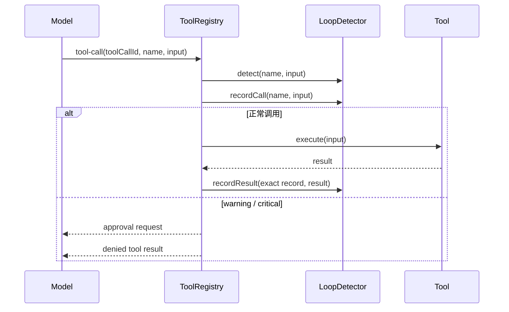

# Loop Detection

每次 `agentLoop()` 都创建独立的 `LoopDetector`，历史不会跨用户轮次或会话泄漏。每个调用用 `toolCallId` 绑定到自己的 `ToolCallRecord`，并行工具即使乱序返回，也会把结果写回正确记录。

## 检测顺序

1. `global_circuit_breaker`：同一工具、相同参数的已完成调用连续返回相同结果。
2. `ping_pong`：两个参数指纹严格交替，例如 A → B → A → B。
3. `generic_repeat`：滑动窗口内相同工具和参数重复出现。

默认窗口和阈值：

| 配置 | 默认值 | 行为 |
| --- | ---: | --- |
| `historySize` | 30 | 超出后 FIFO 淘汰 |
| `warningThreshold` | 5 | 阻止本次调用，要求模型换思路 |
| `criticalThreshold` | 8 | 阻止同一步全部待审批调用并停止 Agent Loop |
| `breakerThreshold` | 10 | 已完成结果连续无变化时熔断 |

重复和乒乓检测会把“当前待执行调用”计入次数，因此第 5 次相同调用会直接触发 warning。无进展检测只能基于已有结果判断，所以在已有 10 次相同结果后阻止下一次调用。

参数和结果都先稳定序列化再取 SHA-256 短指纹；对象 key 顺序不同不会造成不同指纹。warning/critical 调用仍记录正式的 denied result，使消息链和审计日志保持完整。
