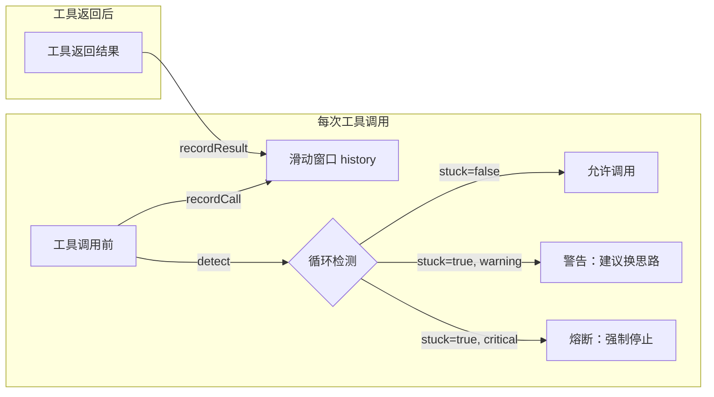
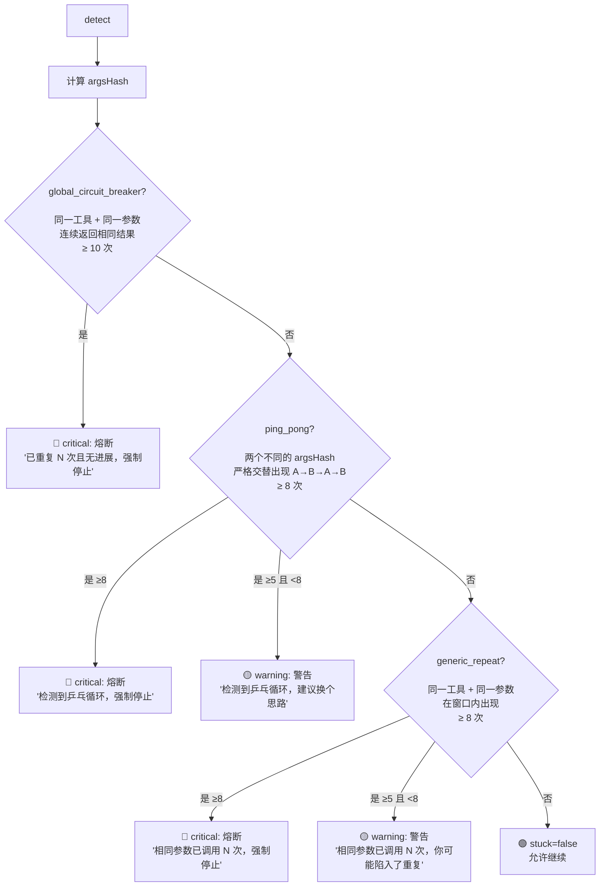
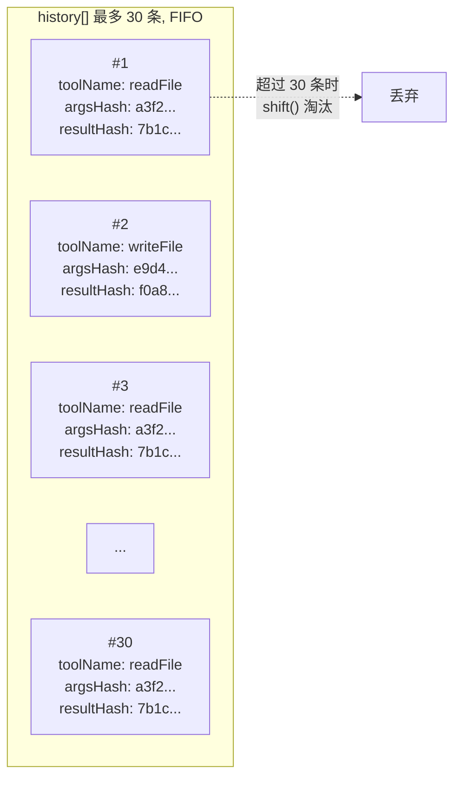
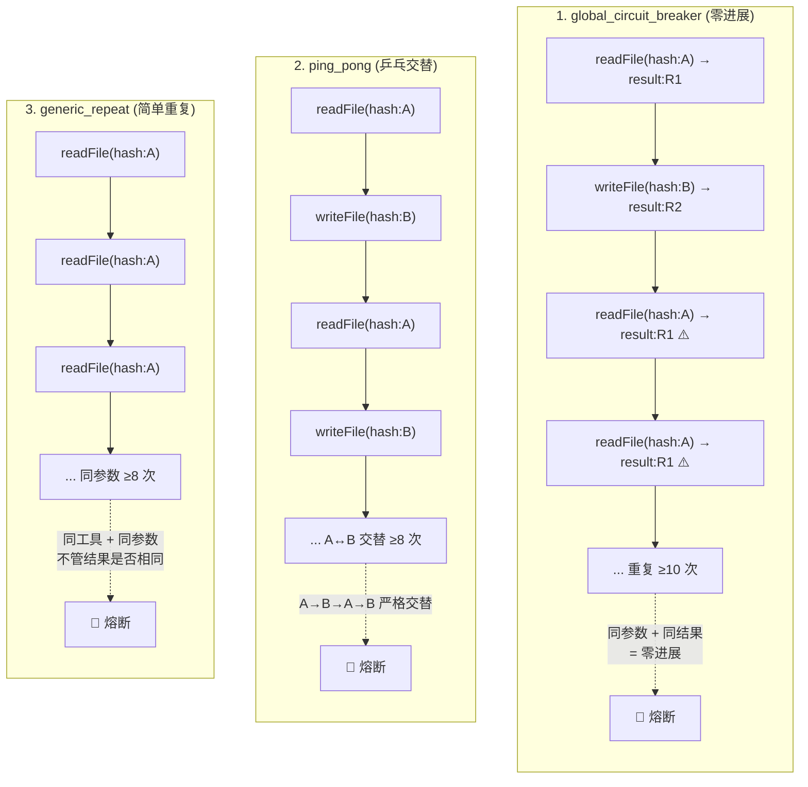
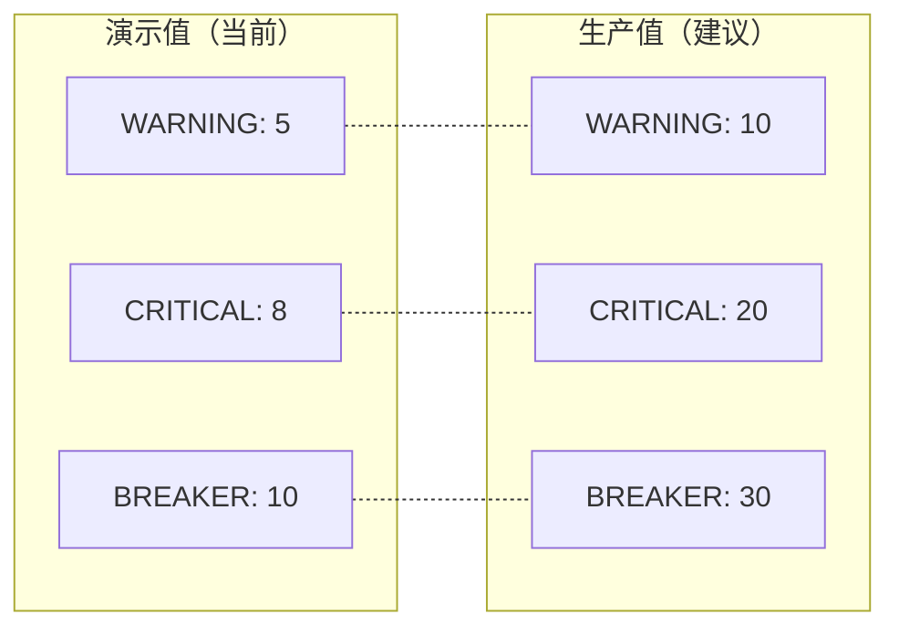

# Loop Detection 流程图

## 整体数据流

```mermaid
flowchart LR
    subgraph 每次工具调用
        A[工具调用前] -->|recordCall| B[滑动窗口 history]
        A -->|detect| C{循环检测}
        C -->|stuck=false| D[允许调用]
        C -->|stuck=true, warning| E[警告：建议换思路]
        C -->|stuck=true, critical| F[熔断：强制停止]
    end

    subgraph 工具返回后
        G[工具返回结果] -->|recordResult| B
    end
```

## detect() 检测优先级

```mermaid
flowchart TD
    START[detect] --> FINGER["计算 argsHash"]
    FINGER --> CHECK1{global_circuit_breaker?

同一工具 + 同一参数
连续返回相同结果
≥ 10 次}

    CHECK1 -->|是| CRITICAL1["🔴 critical: 熔断
'已重复 N 次且无进展，强制停止'"]

    CHECK1 -->|否| CHECK2{ping_pong?

两个不同的 argsHash
严格交替出现 A→B→A→B
≥ 8 次}

    CHECK2 -->|是 ≥8| CRITICAL2["🔴 critical: 熔断
'检测到乒乓循环，强制停止'"]
    CHECK2 -->|是 ≥5 且 <8| WARNING2["🟡 warning: 警告
'检测到乒乓循环，建议换个思路'"]

    CHECK2 -->|否| CHECK3{generic_repeat?

同一工具 + 同一参数
在窗口内出现
≥ 8 次}

    CHECK3 -->|是 ≥8| CRITICAL3["🔴 critical: 熔断
'相同参数已调用 N 次，强制停止'"]
    CHECK3 -->|是 ≥5 且 <8| WARNING3["🟡 warning: 警告
'相同参数已调用 N 次，你可能陷入了重复'"]

    CHECK3 -->|否| OK["🟢 stuck=false
允许继续"]
```

## 滑动窗口示例

```mermaid
flowchart LR
    subgraph "history[] 最多 30 条, FIFO"
        direction LR
        H1["#1
toolName: readFile
argsHash: a3f2...
resultHash: 7b1c..."]
        H2["#2
toolName: writeFile
argsHash: e9d4...
resultHash: f0a8..."]
        H3["#3
toolName: readFile
argsHash: a3f2...
resultHash: 7b1c..."]
        H4["..."]
        H5["#30
toolName: readFile
argsHash: a3f2...
resultHash: 7b1c..."]
    end

    H1 -.->|"超过 30 条时
shift() 淘汰"| X["丢弃"]
```

## 三种检测器的触发场景

```mermaid
flowchart TB
    subgraph "1. global_circuit_breaker (零进展)"
        direction TB
        C1["readFile(hash:A) → result:R1"]
        C2["writeFile(hash:B) → result:R2"]
        C3["readFile(hash:A) → result:R1 ⚠️"]
        C4["readFile(hash:A) → result:R1 ⚠️"]
        C5["... 重复 ≥10 次"]
        C1 --> C2 --> C3 --> C4 --> C5
        C5 -.->|"同参数 + 同结果
= 零进展"| TRIP1["🔴 熔断"]
    end

    subgraph "2. ping_pong (乒乓交替)"
        direction TB
        P1["readFile(hash:A)"]
        P2["writeFile(hash:B)"]
        P3["readFile(hash:A)"]
        P4["writeFile(hash:B)"]
        P5["... A↔B 交替 ≥8 次"]
        P1 --> P2 --> P3 --> P4 --> P5
        P5 -.->|"A→B→A→B 严格交替"| TRIP2["🔴 熔断"]
    end

    subgraph "3. generic_repeat (简单重复)"
        direction TB
        G1["readFile(hash:A)"]
        G2["readFile(hash:A)"]
        G3["readFile(hash:A)"]
        G4["... 同参数 ≥8 次"]
        G1 --> G2 --> G3 --> G4
        G4 -.->|"同工具 + 同参数
不管结果是否相同"| TRIP3["🔴 熔断"]
    end
```

## 阈值速查

```mermaid
flowchart LR
    subgraph "演示值（当前）"
        W1["WARNING: 5"]
        C1["CRITICAL: 8"]
        B1["BREAKER: 10"]
    end

    subgraph "生产值（建议）"
        W2["WARNING: 10"]
        C2["CRITICAL: 20"]
        B2["BREAKER: 30"]
    end

    W1 -.- W2
    C1 -.- C2
    B1 -.- B2
```
